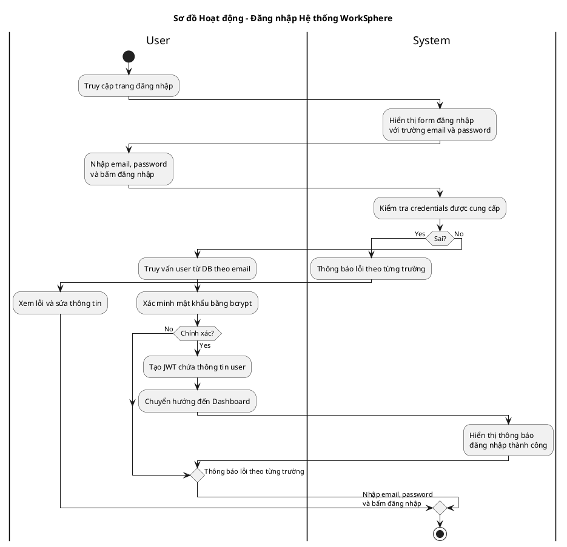

# Sơ đồ Hoạt động: Đăng nhập Hệ thống

## Mô tả

Sơ đồ hoạt động mô tả quy trình đăng nhập vào hệ thống WorkSphere, bao gồm các bước xác thực và xử lý ngoại lệ.

## Sơ đồ Activity Diagram

## Giải thích các thành phần

### Ký hiệu sử dụng

| Ký hiệu      | Ý nghĩa        | Mô tả trong sơ đồ                               |
| ------------ | -------------- | ----------------------------------------------- |
| ● (start)    | Nút bắt đầu    | Người dùng truy cập trang login                 |
| ◉ (stop)     | Nút kết thúc   | Kết thúc quy trình (thành công hoặc bị khóa)    |
| ▭ (action)   | Hành động      | Các bước xử lý cụ thể                           |
| ◇ (decision) | Nút quyết định | Kiểm tra điều kiện (if/else)                    |
| \|Swimlane\| | Làn bơi        | Phân chia theo tác nhân (Người dùng / Hệ thống) |

### Luồng chính (Main Flow)

1. Người dùng truy cập `/login`
2. Hệ thống kiểm tra session → Nếu có thì redirect
3. Hiển thị form đăng nhập
4. Người dùng nhập Email + Password
5. Frontend validate dữ liệu
6. Backend tìm user theo email
7. So sánh password với BCrypt
8. Kiểm tra `isActive`
9. Tạo JWT Session
10. Redirect đến Dashboard

### Luồng ngoại lệ (Exception Flows)

- **E1**: Dữ liệu không hợp lệ → Hiển thị lỗi validation
- **E2**: Email không tồn tại → Hiển thị "Invalid credentials"
- **E3**: Mật khẩu sai → Hiển thị "Invalid credentials"
- **E4**: Tài khoản bị khóa → Hiển thị "Liên hệ Admin"

## Mapping với Source Code

| Bước              | File/Function                                  |
| ----------------- | ---------------------------------------------- |
| Kiểm tra Session  | `src/lib/auth.ts` - NextAuth session           |
| Validate Frontend | `src/app/login/page.tsx` - Zod schema          |
| Tìm User          | `prisma.user.findUnique({ where: { email } })` |
| So sánh Password  | `bcrypt.compare(password, user.password)`      |
| Kiểm tra isActive | `if (!user.isActive) return null`              |
| Tạo JWT           | NextAuth JWT strategy                          |
