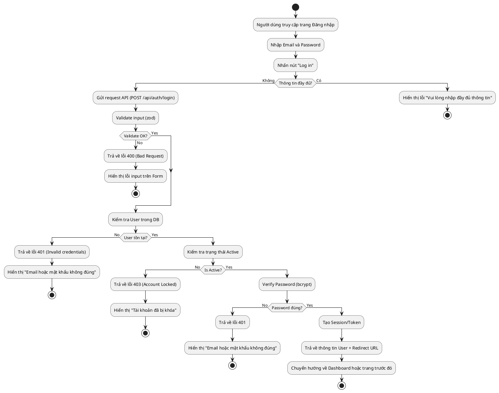

# Activity Diagram: Đăng nhập hệ thống

Mô tả luồng hoạt động của quá trình đăng nhập, bao gồm xác thực và xử lý lỗi.

```plantuml
@startuml
start

:Người dùng truy cập trang Đăng nhập;
:Nhập Email và Password;
:Nhấn nút "Log in";

if (Thông tin đầy đủ?) then (Không)
  :Gửi request API (POST /api/auth/login);
  :Validate input (zod);
  if (Validate OK?) then (No)
    :Trả về lỗi 400 (Bad Request);
    :Hiển thị lỗi input trên Form;
    stop
  else (Yes)
  endif
  
  :Kiểm tra User trong DB;
  
  if (User tồn tại?) then (No)
     :Trả về lỗi 401 (Invalid credentials);
     :Hiển thị "Email hoặc mật khẩu không đúng";
     stop
  else (Yes)
     :Kiểm tra trạng thái Active;
     if (Is Active?) then (No)
        :Trả về lỗi 403 (Account Locked);
        :Hiển thị "Tài khoản đã bị khóa";
        stop
     else (Yes)
        :Verify Password (bcrypt);
        if (Password đúng?) then (No)
           :Trả về lỗi 401;
           :Hiển thị "Email hoặc mật khẩu không đúng";
           stop
        else (Yes)
           :Tạo Session/Token;
           :Trả về thông tin User + Redirect URL;
           :Chuyển hướng về Dashboard hoặc trang trước đó;
           stop
        endif
     endif
  endif
else (Có)
  :Hiển thị lỗi "Vui lòng nhập đầy đủ thông tin";
  stop
endif

@enduml
```
