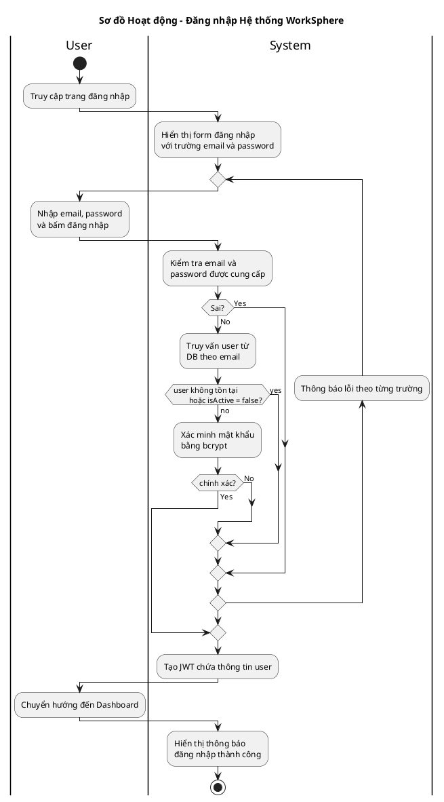

# Sơ đồ Hoạt động: Đăng nhập Hệ thống

## Mô tả

Sơ đồ hoạt động mô tả quy trình đăng nhập vào hệ thống WorkSphere, bao gồm các bước xác thực và xử lý ngoại lệ.

## Sơ đồ Activity Diagram

```plantuml
@startuml
title Sơ đồ Hoạt động - Đăng nhập Hệ thống WorkSphere

|User|
start
:Truy cập trang đăng nhập;

|System|
:Hiển thị form đăng nhập
với trường email và password;

repeat

    |User|
    :Nhập email, password
    và bấm đăng nhập;

    |System|
    :Kiểm tra email và
    password được cung cấp;

    if (Sai?) then (Yes)
    else (No)
        :Truy vấn user từ
        DB theo email;

        if (user không tồn tại
        hoặc isActive = false?) then (yes)
        else (no)
            :Xác minh mật khẩu
            bằng bcrypt;

            if (chính xác?) then (Yes)
                break
            else (No)
            endif
        endif
    endif

backward :Thông báo lỗi theo từng trường;
repeat while ()

|System|
:Tạo JWT chứa thông tin user;

|User|
:Chuyển hướng đến Dashboard;

|System|
:Hiển thị thông báo
đăng nhập thành công;

stop

@enduml
```
