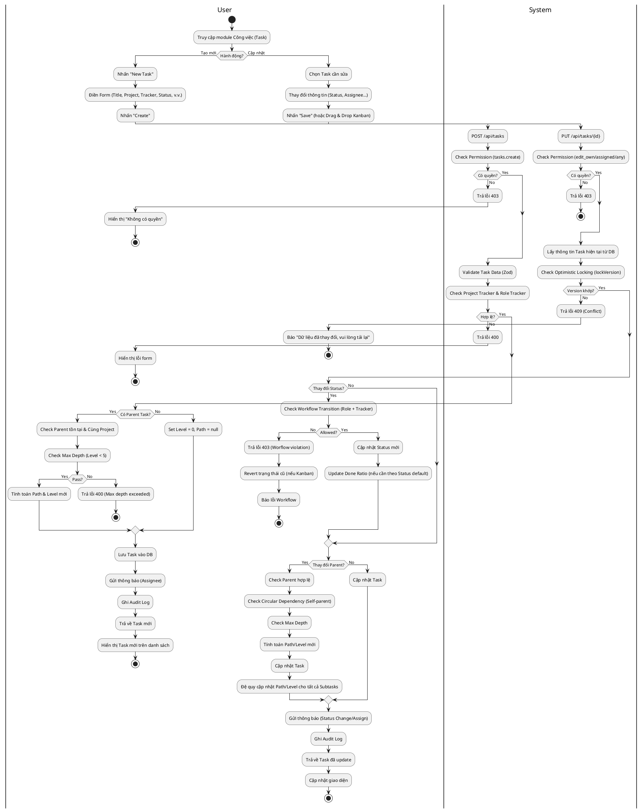

# Activity Diagram: Quản lý Công việc (Tạo mới & Cập nhật)

Mô tả luồng hoạt động khi tạo và cập nhật công việc, bao gồm kiểm tra quyền, validate workflow và logic cha-con.

```plantuml
@startuml
|User|
start
:Truy cập module Công việc (Task);
if (Hành động?) then (Tạo mới)
  :Nhấn "New Task";
  :Điền Form (Title, Project, Tracker, Status, v.v.);
  :Nhấn "Create";
  |System|
  :POST /api/tasks;
  :Check Permission (tasks.create);
  if (Có quyền?) then (No)
    :Trả lỗi 403;
    |User|
    :Hiển thị "Không có quyền";
    stop
  else (Yes)
  endif
  |System|
  :Validate Task Data (Zod);
  :Check Project Tracker & Role Tracker;
  if (Hợp lệ?) then (No)
    :Trả lỗi 400;
    |User|
    :Hiển thị lỗi form;
    stop
  else (Yes)
  endif
  
  if (Có Parent Task?) then (Yes)
    :Check Parent tồn tại & Cùng Project;
    :Check Max Depth (Level < 5);
    if (Pass?) then (Yes)
      :Tính toán Path & Level mới;
    else (No)
      :Trả lỗi 400 (Max depth exceeded);
      stop
    endif
  else (No)
    :Set Level = 0, Path = null;
  endif
  
  :Lưu Task vào DB;
  :Gửi thông báo (Assignee);
  :Ghi Audit Log;
  :Trả về Task mới;
  |User|
  :Hiển thị Task mới trên danh sách;
  stop

else (Cập nhật)
  |User|
  :Chọn Task cần sửa;
  :Thay đổi thông tin (Status, Assignee...);
  :Nhấn "Save" (hoặc Drag & Drop Kanban);
  |System|
  :PUT /api/tasks/{id};
  :Check Permission (edit_own/assigned/any);
  if (Có quyền?) then (No)
    :Trả lỗi 403;
    stop
  else (Yes)
  endif
  
  :Lấy thông tin Task hiện tại từ DB;
  :Check Optimistic Locking (lockVersion);
  if (Version khớp?) then (No)
    :Trả lỗi 409 (Conflict);
    |User|
    :Báo "Dữ liệu đã thay đổi, vui lòng tải lại";
    stop
  else (Yes)
  endif
  
  if (Thay đổi Status?) then (Yes)
    :Check Workflow Transition (Role + Tracker);
    if (Allowed?) then (No)
      :Trả lỗi 403 (Worflow violation);
      |User|
      :Revert trạng thái cũ (nếu Kanban);
      :Báo lỗi Workflow;
      stop
    else (Yes)
      :Cập nhật Status mới;
      :Update Done Ratio (nếu cần theo Status default);
    endif
  else (No)
  endif
  
  if (Thay đổi Parent?) then (Yes)
    :Check Parent hợp lệ;
    :Check Circular Dependency (Self-parent);
    :Check Max Depth;
    :Tính toán Path/Level mới;
    :Cập nhật Task;
    :Đệ quy cập nhật Path/Level cho tất cả Subtasks;
  else (No)
    :Cập nhật Task;
  endif
  
  :Gửi thông báo (Status Change/Assign);
  :Ghi Audit Log;
  :Trả về Task đã update;
  |User|
  :Cập nhật giao diện;
  stop
endif
@enduml
```
