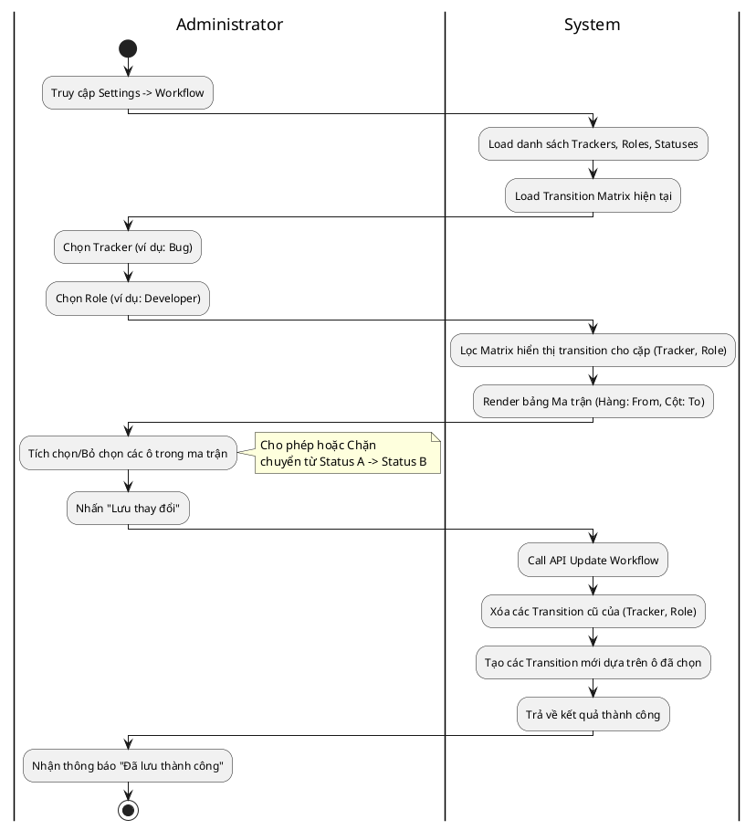

# Activity Diagram: Quản lý Quy trình Worklow

Mô tả luồng hoạt động cấu hình Workflow, cho phép chuyển đổi trạng thái dựa trên Vai trò và Tracker.

```plantuml
@startuml
|Administrator|
start
:Truy cập Settings -> Workflow;
|System|
:Load danh sách Trackers, Roles, Statuses;
:Load Transition Matrix hiện tại;
|Administrator|
:Chọn Tracker (ví dụ: Bug);
:Chọn Role (ví dụ: Developer);
|System|
:Lọc Matrix hiển thị transition cho cặp (Tracker, Role);
:Render bảng Ma trận (Hàng: From, Cột: To);
|Administrator|
:Tích chọn/Bỏ chọn các ô trong ma trận;
note right
  Cho phép hoặc Chặn
  chuyển từ Status A -> Status B
end note
:Nhấn "Lưu thay đổi";
|System|
:Call API Update Workflow;
:Xóa các Transition cũ của (Tracker, Role);
:Tạo các Transition mới dựa trên ô đã chọn;
:Trả về kết quả thành công;
|Administrator|
:Nhận thông báo "Đã lưu thành công";
stop
@enduml
```
