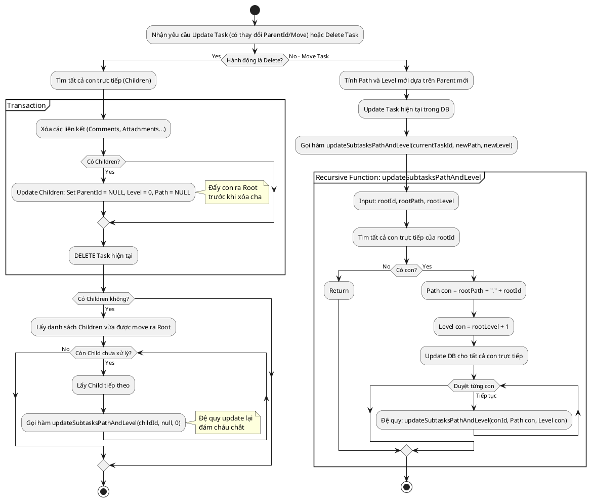

# Activity Diagram: Tính toán & Cập nhật Subtask Hierarchy (Khi Di chuyển/Xóa Task)

Mô tả luồng xử lý đệ quy phức tạp ở Backend khi cấu trúc cha-con thay đổi.

```plantuml
@startuml
start
:Nhận yêu cầu Update Task (có thay đổi ParentId/Move) hoặc Delete Task;

if (Hành động là Delete?) then (Yes)
  :Tìm tất cả con trực tiếp (Children);
  partition "Transaction" {
    :Xóa các liên kết (Comments, Attachments...);
    if (Có Children?) then (Yes)
      :Update Children: Set ParentId = NULL, Level = 0, Path = NULL;
      note right
        Đẩy con ra Root
        trước khi xóa cha
      end note
    endif
    :DELETE Task hiện tại;
  }
  
  if (Có Children không?) then (Yes)
    :Lấy danh sách Children vừa được move ra Root;
    while (Còn Child chưa xử lý?) is (Yes)
       :Lấy Child tiếp theo;
       :Gọi hàm updateSubtasksPathAndLevel(childId, null, 0);
       note right
         Đệ quy update lại
         đám cháu chắt
       end note
    endwhile (No)
  endif
  stop

else (No - Move Task)
  :Tính Path và Level mới dựa trên Parent mới;
  :Update Task hiện tại trong DB;
  
  :Gọi hàm updateSubtasksPathAndLevel(currentTaskId, newPath, newLevel);
  
  partition "Recursive Function: updateSubtasksPathAndLevel" {
    :Input: rootId, rootPath, rootLevel;
    :Tìm tất cả con trực tiếp của rootId;
    if (Có con?) then (No)
      :Return;
    else (Yes)
      :Path con = rootPath + "." + rootId;
      :Level con = rootLevel + 1;
      :Update DB cho tất cả con trực tiếp;
      
      while (Duyệt từng con) is (Tiếp tục)
        :Đệ quy: updateSubtasksPathAndLevel(conId, Path con, Level con);
      endwhile
    endif
  }
  stop
endif

@enduml
```
