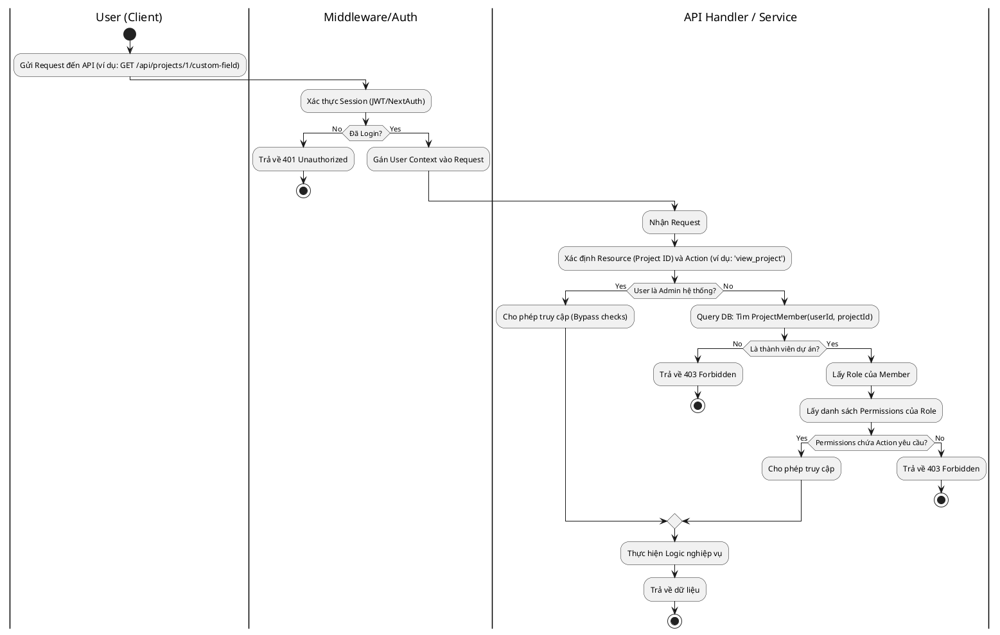

# Activity Diagram: Phân quyền RBAC (Middleware & Service Check)

Mô tả cách hệ thống kiểm tra quyền truy cập (Permission Check) tại các tầng.

```plantuml
@startuml
|User (Client)|
start
:Gửi Request đến API (ví dụ: GET /api/projects/1/custom-field);
|Middleware/Auth|
:Xác thực Session (JWT/NextAuth);
if (Đã Login?) then (No)
  :Trả về 401 Unauthorized;
  stop
else (Yes)
  :Gán User Context vào Request;
endif

|API Handler / Service|
:Nhận Request;
:Xác định Resource (Project ID) và Action (ví dụ: 'view_project');

if (User là Admin hệ thống?) then (Yes)
  :Cho phép truy cập (Bypass checks);
else (No)
  :Query DB: Tìm ProjectMember(userId, projectId);
  if (Là thành viên dự án?) then (No)
    :Trả về 403 Forbidden;
    stop
  else (Yes)
    :Lấy Role của Member;
    :Lấy danh sách Permissions của Role;
    if (Permissions chứa Action yêu cầu?) then (Yes)
      :Cho phép truy cập;
    else (No)
      :Trả về 403 Forbidden;
      stop
    endif
  endif
endif

:Thực hiện Logic nghiệp vụ;
:Trả về dữ liệu;
stop
@enduml
```
