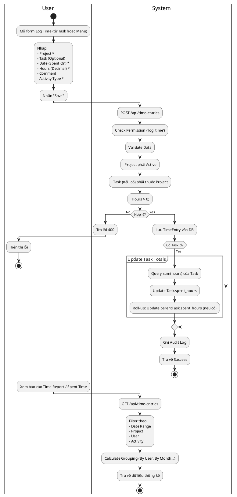

# Activity Diagram: Quản lý Time Tracking (Log Time)

Mô tả luồng ghi nhận thời gian làm việc (Time Entries) và tính toán báo cáo.

```plantuml
@startuml
|User|
start
:Mở form Log Time (từ Task hoặc Menu);
:Nhập:
- Project *
- Task (Optional)
- Date (Spent On) *
- Hours (Decimal) *
- Comment
- Activity Type *;

:Nhấn "Save";

|System|
:POST /api/time-entries;
:Check Permission ('log_time');

:Validate Data;
- Project phải Active
- Task (nếu có) phải thuộc Project
- Hours > 0;

if (Hợp lệ?) then (No)
  :Trả lỗi 400;
  |User|
  :Hiển thị lỗi;
  stop
else (Yes)
  |System|
  :Lưu TimeEntry vào DB;
  
  if (Có TaskId?) then (Yes)
    partition "Update Task Totals" {
      :Query sum(hours) của Task;
      :Update Task.spent_hours;
      :Roll-up: Update parentTask.spent_hours (nếu có);
    }
  endif
  
  :Ghi Audit Log;
  :Trả về Success;
  stop
endif

|User|
:Xem báo cáo Time Report / Spent Time;
|System|
:GET /api/time-entries;
:Filter theo:
- Date Range
- Project
- User
- Activity;
:Calculate Grouping (By User, By Month...);
:Trả về dữ liệu thống kê;
stop
@enduml
```
