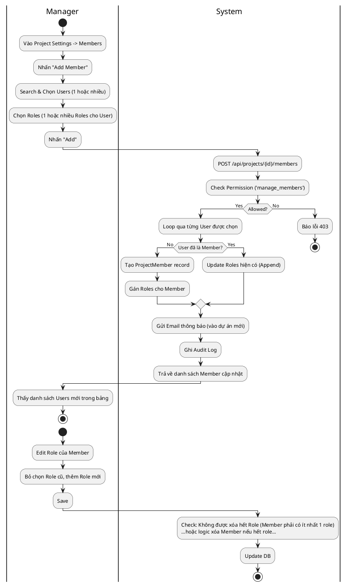

# Activity Diagram: Quản lý Member & Roles (Add/Remove Member)

Mô tả luồng thêm thành viên vào dự án và phân vai trò.

```plantuml
@startuml
|Manager|
start
:Vào Project Settings -> Members;
:Nhấn "Add Member";
:Search & Chọn Users (1 hoặc nhiều);
:Chọn Roles (1 hoặc nhiều Roles cho User);
:Nhấn "Add";

|System|
:POST /api/projects/{id}/members;
:Check Permission ('manage_members');

if (Allowed?) then (Yes)
  :Loop qua từng User được chọn;
  if (User đã là Member?) then (No)
    :Tạo ProjectMember record;
    :Gán Roles cho Member;
  else (Yes)
    :Update Roles hiện có (Append);
  endif
  :Gửi Email thông báo (vào dự án mới);
  :Ghi Audit Log;
  :Trả về danh sách Member cập nhật;
else (No)
  :Báo lỗi 403;
  stop
endif

|Manager|
:Thấy danh sách Users mới trong bảng;
stop

|Manager|
start
:Edit Role của Member;
:Bỏ chọn Role cũ, thêm Role mới;
:Save;
|System|
:Check: Không được xóa hết Role (Member phải có ít nhất 1 role) 
...hoặc logic xóa Member nếu hết role...;
:Update DB;
stop
@enduml
```
