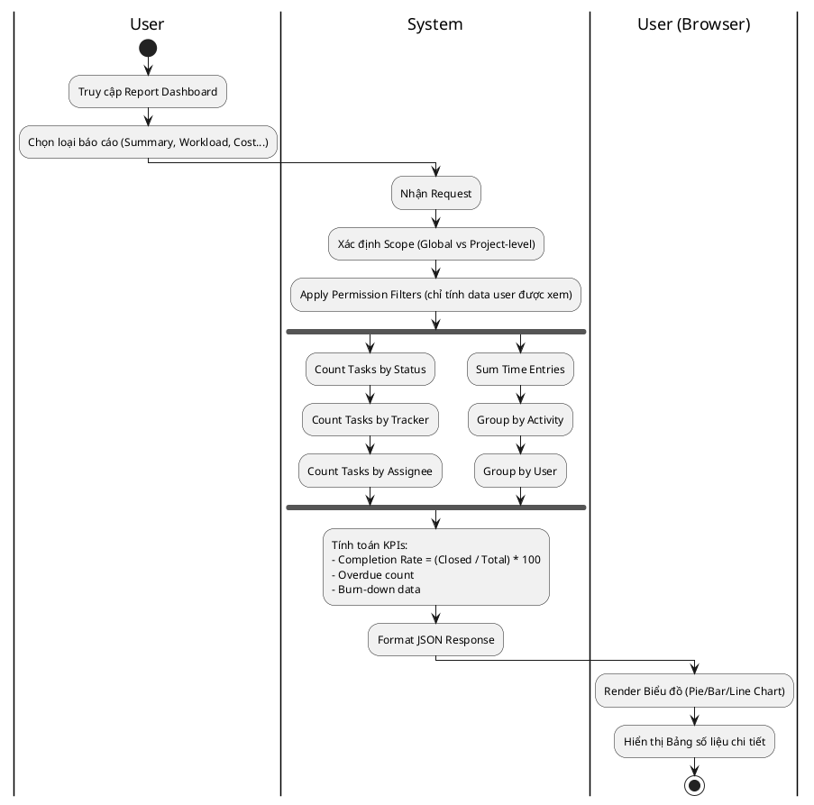

# Activity Diagram: Tính toán Báo cáo (Report generation)

Mô tả luồng tổng hợp dữ liệu cho các Dashboard và Báo cáo.

```plantuml
@startuml
|User|
start
:Truy cập Report Dashboard;
:Chọn loại báo cáo (Summary, Workload, Cost...);

|System|
:Nhận Request;
:Xác định Scope (Global vs Project-level);
:Apply Permission Filters (chỉ tính data user được xem);

fork
  :Count Tasks by Status;
  :Count Tasks by Tracker;
  :Count Tasks by Assignee;
fork again
  :Sum Time Entries;
  :Group by Activity;
  :Group by User;
end fork

:Tính toán KPIs:
- Completion Rate = (Closed / Total) * 100
- Overdue count
- Burn-down data;

:Format JSON Response;
|User (Browser)|
:Render Biểu đồ (Pie/Bar/Line Chart);
:Hiển thị Bảng số liệu chi tiết;
stop
@enduml
```
