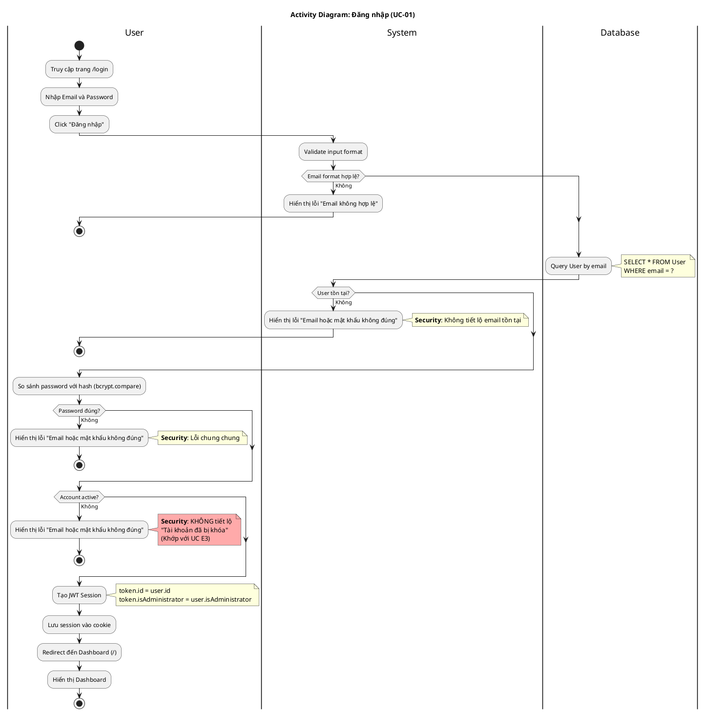

# Activity Diagram 01: Đăng nhập (UC-01)

> **Use Case**: UC-01 - Đăng nhập  
> **Module**: Authentication  
> **Phiên bản**: 1.1  
> **Ngày cập nhật**: 2026-01-16

---

## 1. Thông tin chung

| Thuộc tính | Giá trị |
|------------|---------|
| **Actors** | User |
| **Độ phức tạp** | Trung bình |
| **Swimlanes** | User, System, Database |
| **Số Decision nodes** | 4 |
| **Use Case tham chiếu** | [UC-01](../usecases/01-authentication.md) |

---

## 2. Activity Diagram (PlantUML)

---

## 3. Mô tả các bước (Khớp với UC-01 Main Flow)

| # UC | # AD | Actor | Hành động | Ghi chú |
|------|------|-------|-----------|---------| 
| 1 | 1 | User | Truy cập trang đăng nhập | /login |
| 2 | - | System | Hiển thị form | (implicit) |
| 3-4 | 2 | User | Nhập email & password | Required fields |
| 5 | 3 | User | Click Đăng nhập | Submit form |
| 6 | 4-5 | System/DB | Kiểm tra email tồn tại | Query by email |
| 7 | 6 | System | Xác minh password | bcrypt.compare() |
| 8 | 7 | System | Kiểm tra isActive | Boolean field |
| 9 | 8-9 | System | Tạo phiên đăng nhập | JWT session |
| 10 | 10 | User | Chuyển đến Dashboard | Redirect |

---

## 4. Decision Points (Khớp với UC Exception Flows)

| # | Condition | True | False | UC Ref |
|---|-----------|------|-------|--------|
| D1 | Email format hợp lệ? | Tiếp tục | Lỗi, dừng | - |
| D2 | User tồn tại? | Tiếp tục | Lỗi chung, dừng | E1 |
| D3 | Password đúng? | Tiếp tục | Lỗi chung, dừng | E2 |
| D4 | Account active? | Tạo session | **Lỗi chung**, dừng | **E3** |

---

## 5. Exception Handling (Khớp với UC)

| Exception | Xử lý | UC Ref |
|-----------|-------|--------|
| Email không tồn tại | Hiển thị lỗi **chung** (security) | E1 |
| Password sai | Hiển thị lỗi **chung** (security) | E2 |
| Account bị khóa | Hiển thị lỗi **chung** (security) | **E3** |
| Database error | Hiển thị lỗi server | E4 |

**Lưu ý quan trọng**: 
- Tất cả lỗi xác thực đều hiển thị thông báo **chung** "Email hoặc mật khẩu không đúng"
- KHÔNG tiết lộ việc tài khoản bị khóa (theo UC E3)

---

*Cập nhật: 2026-01-16 - Đồng bộ với UC-01*
