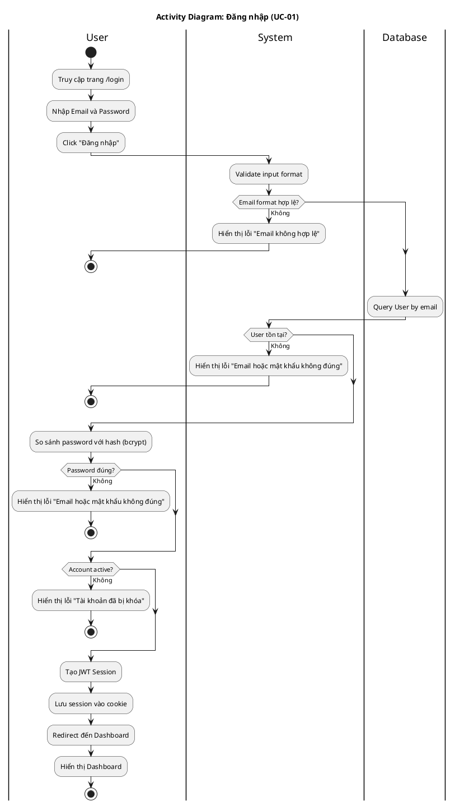

# Activity Diagram 01: Đăng nhập (UC-01)

> **Use Case**: UC-01 - Đăng nhập  
> **Module**: Authentication  
> **Ngày**: 2026-01-15

---

## 1. Thông tin chung

| Thuộc tính | Giá trị |
|------------|---------|
| **Actors** | User |
| **Độ phức tạp** | Trung bình |
| **Swimlanes** | User, System, Database |
| **Số Decision nodes** | 4 |

---

## 2. Activity Diagram (PlantUML)

---

## 3. Mô tả các bước

| # | Actor | Hành động | Ghi chú |
|---|-------|-----------|---------|
| 1 | User | Truy cập /login | - |
| 2 | User | Nhập email & password | Required fields |
| 3 | User | Click Đăng nhập | Submit form |
| 4 | System | Validate email format | Regex validation |
| 5 | Database | Query user by email | SELECT * FROM User WHERE email = ? |
| 6 | System | Compare password hash | bcrypt.compare() |
| 7 | System | Check isActive | Boolean field |
| 8 | System | Create JWT session | NextAuth signIn |
| 9 | User | Redirect to Dashboard | / |

---

## 4. Decision Points

| # | Condition | True | False |
|---|-----------|------|-------|
| D1 | Email format hợp lệ? | Tiếp tục | Hiển thị lỗi, dừng |
| D2 | User tồn tại? | Tiếp tục | Hiển thị lỗi, dừng |
| D3 | Password đúng? | Tiếp tục | Hiển thị lỗi, dừng |
| D4 | Account active? | Tạo session | Hiển thị lỗi, dừng |

---

## 5. Exception Handling

| Exception | Xử lý |
|-----------|-------|
| Email không tồn tại | Hiển thị lỗi chung (security) |
| Password sai | Hiển thị lỗi chung (security) |
| Account bị khóa | Hiển thị lỗi cụ thể |
| Database error | Hiển thị lỗi server |

---

*Ngày tạo: 2026-01-15*
