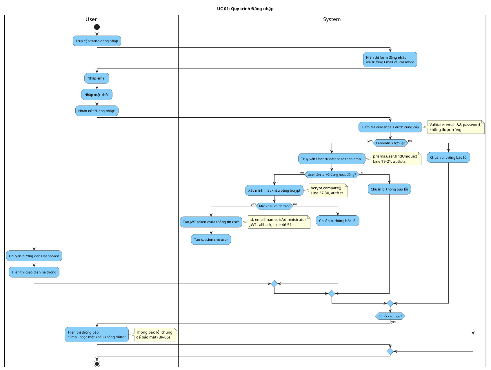

# Activity Diagram: UC-01 - Đăng nhập

> **Module**: Authentication  
> **Use Case ID**: UC-01  
> **Tên Use Case**: Đăng nhập  
> **Ngày tạo**: 2026-01-16

---

## 1. Phân tích LTOT

### 1.1. Mục đích
- Cho phép người dùng xác thực bằng email/password để truy cập hệ thống

### 1.2. Actors
- **User**: Người dùng chưa đăng nhập
- **System**: Hệ thống Worksphere

### 1.3. Kết quả có thể
- **Success**: User được xác thực, chuyển đến Dashboard
- **Failure**: Hiển thị lỗi, quay lại form

### 1.4. Các bước chính
1. User truy cập trang login
2. System hiển thị form
3. User nhập email/password
4. System validate credentials
5. System tạo JWT session
6. Chuyển đến Dashboard

---

## 2. Activity Diagram

---

## 3. Source Code Reference

| File | Function/Method | Line | Mô tả |
|------|-----------------|------|-------|
| `src/lib/auth.ts` | `authorize()` | 14-42 | Xác thực credentials |
| `src/lib/auth.ts` | `jwt()` callback | 46-51 | Tạo JWT token |
| `src/lib/auth.ts` | `session()` callback | 53-58 | Tạo session |
| `src/app/login/page.tsx` | `handleSubmit()` | 14-37 | Xử lý submit form |

---

## 4. Business Rules

| ID | Rule | Mô tả |
|----|------|-------|
| BR-01 | Password Hashing | Mật khẩu được hash bằng bcrypt |
| BR-02 | Session Strategy | Sử dụng JWT strategy |
| BR-03 | Active Account Only | Chỉ tài khoản isActive=true mới được đăng nhập |
| BR-04 | Check Order | Kiểm tra: user exists → isActive → password |
| BR-05 | Generic Error | Thông báo lỗi không tiết lộ email tồn tại hay không |

---

## 5. Checklist LTOT

- [x] Có đúng 1 start
- [x] Có đúng 1 stop
- [x] Tất cả if-else đều có endif
- [x] Swimlanes phân chia rõ User/System
- [x] Activity đặt tên bằng động từ rõ ràng
- [x] Guard conditions cụ thể, có thể test

---

*Tài liệu được tạo dựa trên phân tích mã nguồn Worksphere*  
*Ngày tạo: 2026-01-16*
