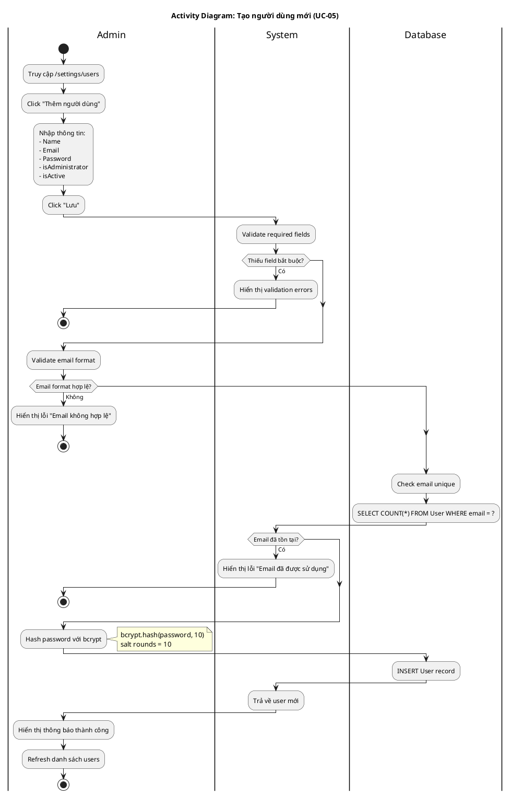

# Activity Diagram 02: Tạo người dùng mới (UC-05)

> **Use Case**: UC-05 - Tạo người dùng mới  
> **Module**: User Management  
> **Ngày**: 2026-01-15

---

## 1. Thông tin chung

| Thuộc tính | Giá trị |
|------------|---------|
| **Actors** | Administrator |
| **Độ phức tạp** | Trung bình |
| **Swimlanes** | Admin, System, Database |

---

## 2. Activity Diagram (PlantUML)

---

## 3. Mô tả các bước

| # | Actor | Hành động | Ghi chú |
|---|-------|-----------|---------|
| 1 | Admin | Truy cập trang users | /settings/users |
| 2 | Admin | Click thêm user | Open modal/form |
| 3 | Admin | Nhập thông tin | All fields |
| 4 | System | Validate required | name, email, password |
| 5 | System | Validate email format | Regex |
| 6 | Database | Check email unique | COUNT query |
| 7 | System | Hash password | bcrypt, salt=10 |
| 8 | Database | Insert user | CREATE |
| 9 | Admin | Thông báo thành công | Toast/Alert |

---

## 4. Decision Points

| # | Condition | True | False |
|---|-----------|------|-------|
| D1 | Thiếu field bắt buộc? | Hiển thị errors | Tiếp tục |
| D2 | Email format hợp lệ? | Tiếp tục | Hiển thị lỗi |
| D3 | Email đã tồn tại? | Hiển thị lỗi | Tiếp tục |

---

*Ngày tạo: 2026-01-15*
