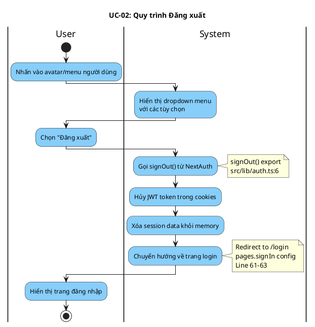

# Activity Diagram: UC-02 - Đăng xuất

> **Module**: Authentication  
> **Use Case ID**: UC-02  
> **Tên Use Case**: Đăng xuất  
> **Ngày tạo**: 2026-01-16

---

## 1. Phân tích LTOT

### 1.1. Mục đích
- Cho phép người dùng kết thúc phiên làm việc và thoát khỏi hệ thống an toàn

### 1.2. Actors
- **User**: Người dùng đã đăng nhập
- **System**: Hệ thống Worksphere

### 1.3. Kết quả có thể
- **Success**: Session bị hủy, chuyển về trang login

### 1.4. Các bước chính
1. User nhấn vào menu avatar
2. User chọn "Đăng xuất"
3. System hủy session
4. System redirect về login

---

## 2. Activity Diagram

---

## 3. Source Code Reference

| File | Function/Method | Line | Mô tả |
|------|-----------------|------|-------|
| `src/lib/auth.ts` | `signOut` export | 6 | Export signOut function từ NextAuth |
| `src/lib/auth.ts` | `pages.signIn` | 61-63 | Cấu hình redirect đến /login |

---

## 4. Business Rules

| ID | Rule | Mô tả |
|----|------|-------|
| BR-01 | Complete Logout | Session phải được hủy hoàn toàn |
| BR-02 | Redirect | Luôn chuyển về trang login sau đăng xuất |
| BR-03 | Clear State | Xóa tất cả thông tin xác thực khỏi browser |

---

## 5. Checklist LTOT

- [x] Có đúng 1 start
- [x] Có đúng 1 stop
- [x] Luồng đơn giản, không có decision phức tạp
- [x] Swimlanes phân chia rõ User/System
- [x] Activity đặt tên bằng động từ rõ ràng

---

*Tài liệu được tạo dựa trên phân tích mã nguồn Worksphere*  
*Ngày tạo: 2026-01-16*
