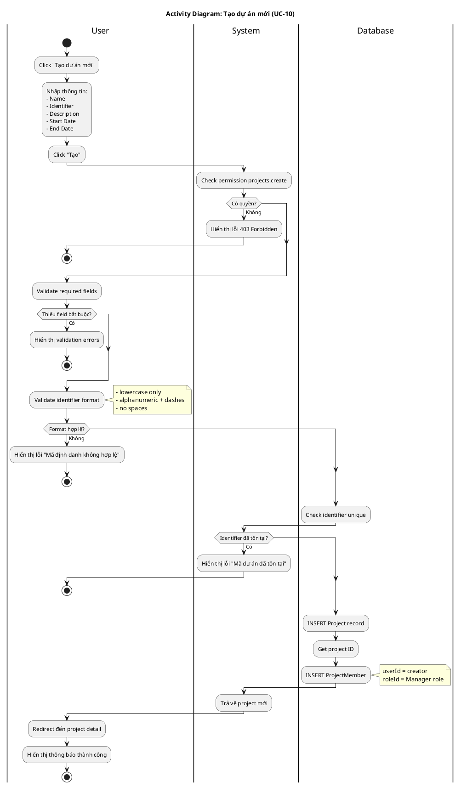

# Activity Diagram 03: Tạo dự án mới (UC-10)

> **Use Case**: UC-10 - Tạo dự án mới  
> **Module**: Project Management  
> **Ngày**: 2026-01-15

---

## 1. Thông tin chung

| Thuộc tính | Giá trị |
|------------|---------|
| **Actors** | User |
| **Độ phức tạp** | Trung bình |
| **Swimlanes** | User, System, Database |

---

## 2. Activity Diagram (PlantUML)

---

## 3. Mô tả các bước

| # | Actor | Hành động | Ghi chú |
|---|-------|-----------|---------|
| 1 | User | Click tạo dự án | Button/Link |
| 2 | User | Nhập thông tin | Form fields |
| 3 | System | Check permission | projects.create |
| 4 | System | Validate required | name, identifier |
| 5 | System | Validate identifier format | Regex: ^[a-z0-9-]+$ |
| 6 | Database | Check unique | identifier |
| 7 | Database | Create project | INSERT |
| 8 | Database | Create member | Auto-assign creator |
| 9 | User | View project | Redirect |

---

## 4. Business Rules

| Rule | Mô tả |
|------|-------|
| BR-01 | Identifier phải unique |
| BR-02 | Identifier: lowercase, alphanumeric, dashes |
| BR-03 | Creator tự động thành member với role Manager |

---

*Ngày tạo: 2026-01-15*
