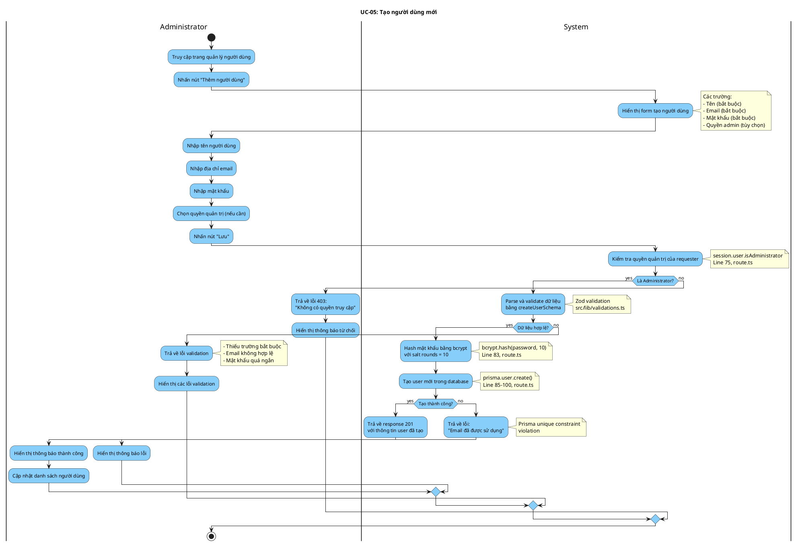

# Activity Diagram: UC-05 - Tạo người dùng mới

> **Module**: User Management  
> **Use Case ID**: UC-05  
> **Tên Use Case**: Tạo người dùng mới  
> **Ngày tạo**: 2026-01-16

---

## 1. Phân tích LTOT

### 1.1. Mục đích
- Cho phép Administrator tạo tài khoản người dùng mới trong hệ thống

### 1.2. Actors
- **Administrator**: Quản trị viên hệ thống
- **System**: Hệ thống Worksphere

### 1.3. Kết quả có thể
- **Success**: User mới được tạo với mật khẩu đã hash
- **Failure**: Trả về lỗi validation hoặc email trùng

### 1.4. Các bước chính
1. Admin nhấn "Thêm người dùng"
2. System hiển thị form
3. Admin nhập thông tin
4. System validate và hash password
5. System tạo user trong database
6. Trả về kết quả

---

## 2. Activity Diagram

---

## 3. Source Code Reference

| File | Function/Method | Line | Mô tả |
|------|-----------------|------|-------|
| `src/app/api/users/route.ts` | `POST()` | 71-106 | API tạo user mới |
| `src/lib/validations.ts` | `createUserSchema` | - | Schema validation |
| `bcryptjs` | `hash()` | 83 | Hash mật khẩu |

---

## 4. Business Rules

| ID | Rule | Mô tả |
|----|------|-------|
| BR-01 | Admin Only | Chỉ admin mới được tạo user |
| BR-02 | Unique Email | Email phải unique trong hệ thống |
| BR-03 | Password Hash | Mật khẩu phải được hash trước khi lưu |
| BR-04 | Min Password | Mật khẩu tối thiểu 6 ký tự |
| BR-05 | Active Default | User mới mặc định isActive = true |

---

## 5. Checklist LTOT

- [x] Có đúng 1 start
- [x] Có đúng 1 stop
- [x] Tất cả if-else đều có endif
- [x] Các nhánh error merge về luồng chính
- [x] Swimlanes phân chia rõ Admin/System
- [x] Activity đặt tên bằng động từ rõ ràng

---

*Tài liệu được tạo dựa trên phân tích mã nguồn Worksphere*  
*Ngày tạo: 2026-01-16*
