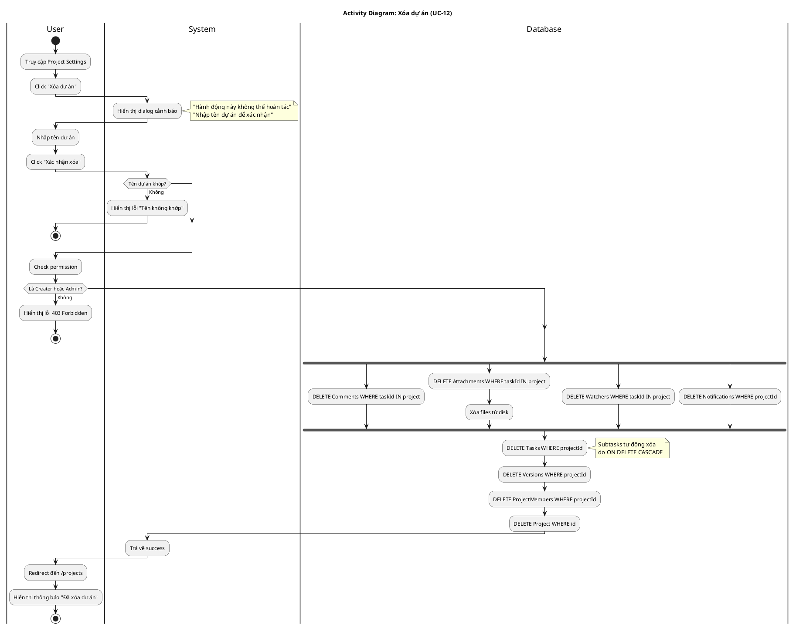

# Activity Diagram 04: Xóa dự án (UC-12)

> **Use Case**: UC-12 - Xóa dự án  
> **Module**: Project Management  
> **Ngày**: 2026-01-15

---

## 1. Thông tin chung

| Thuộc tính | Giá trị |
|------------|---------|
| **Actors** | User (Creator/Admin) |
| **Độ phức tạp** | Cao |
| **Swimlanes** | User, System, Database |
| **Đặc điểm** | Cascade Delete, Fork/Join |

---

## 2. Activity Diagram (PlantUML)

---

## 3. Mô tả Cascade Delete

| Thứ tự | Entity | Điều kiện | Ghi chú |
|--------|--------|-----------|---------|
| 1 | Comments | taskId IN project tasks | - |
| 2 | Attachments | taskId IN project tasks | + Xóa files |
| 3 | Watchers | taskId IN project tasks | - |
| 4 | Notifications | projectId | - |
| 5 | Tasks | projectId | Subtasks cascade |
| 6 | Versions | projectId | - |
| 7 | ProjectMembers | projectId | - |
| 8 | Project | id | Finally |

---

## 4. Decision Points

| # | Condition | True | False |
|---|-----------|------|-------|
| D1 | Tên dự án khớp? | Tiếp tục | Hiển thị lỗi |
| D2 | Là Creator/Admin? | Cascade delete | 403 Forbidden |

---

## 5. Lưu ý quan trọng

⚠️ **Không thể hoàn tác** - Dữ liệu bị xóa vĩnh viễn

---

*Ngày tạo: 2026-01-15*
