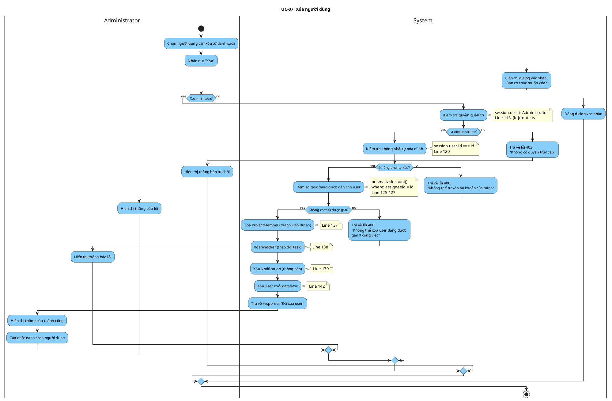

# Activity Diagram: UC-07 - Xóa người dùng

> **Module**: User Management  
> **Use Case ID**: UC-07  
> **Tên Use Case**: Xóa người dùng  
> **Ngày tạo**: 2026-01-16

---

## 1. Phân tích LTOT

### 1.1. Mục đích
- Cho phép Administrator xóa người dùng khỏi hệ thống sau khi kiểm tra ràng buộc

### 1.2. Actors
- **Administrator**: Quản trị viên hệ thống
- **System**: Hệ thống Worksphere

### 1.3. Kết quả có thể
- **Success**: User và dữ liệu liên quan bị xóa
- **Failure**: Từ chối (không có quyền, tự xóa mình, có task được gán)

### 1.4. Các bước chính
1. Admin chọn user cần xóa
2. Admin xác nhận xóa
3. System kiểm tra ràng buộc
4. System xóa dữ liệu liên quan
5. System xóa user
6. Trả về kết quả

---

## 2. Activity Diagram

---

## 3. Source Code Reference

| File | Function/Method | Line | Mô tả |
|------|-----------------|------|-------|
| `src/app/api/users/[id]/route.ts` | `DELETE()` | 109-148 | API xóa user |
| `prisma.task.count()` | - | 125-127 | Kiểm tra task được gán |
| `prisma.projectMember.deleteMany()` | - | 137 | Xóa tư cách thành viên |
| `prisma.watcher.deleteMany()` | - | 138 | Xóa danh sách theo dõi |
| `prisma.notification.deleteMany()` | - | 139 | Xóa thông báo |
| `prisma.user.delete()` | - | 142 | Xóa user |

---

## 4. Business Rules

| ID | Rule | Mô tả |
|----|------|-------|
| BR-01 | Admin Only | Chỉ admin mới được xóa user |
| BR-02 | No Self Delete | Không thể tự xóa tài khoản của mình |
| BR-03 | No Assigned Tasks | Không thể xóa user có task được gán |
| BR-04 | Cascade Delete | Xóa dữ liệu liên quan trước khi xóa user |

---

## 5. Checklist LTOT

- [x] Có đúng 1 start
- [x] Có đúng 1 stop
- [x] Tất cả if-else đều có endif
- [x] Các nhánh error merge về stop chung
- [x] Swimlanes phân chia rõ Admin/System
- [x] Activity đặt tên bằng động từ rõ ràng
- [x] Guard conditions cụ thể, có thể test

---

*Tài liệu được tạo dựa trên phân tích mã nguồn Worksphere*  
*Ngày tạo: 2026-01-16*
