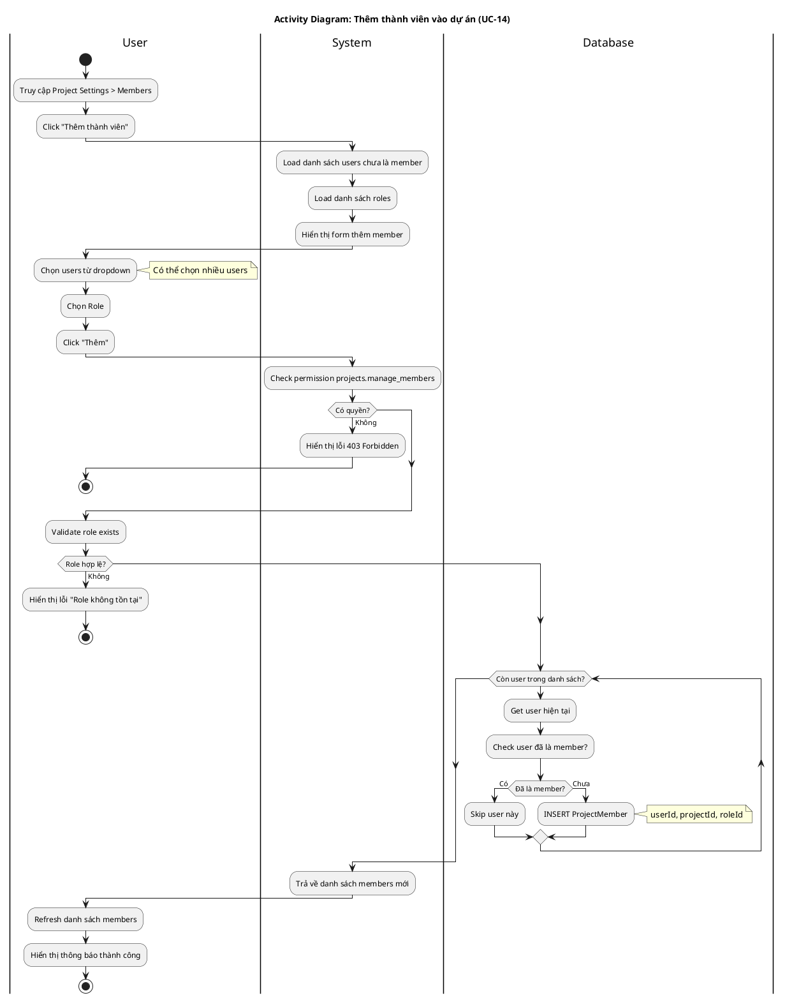

# Activity Diagram 05: Thêm thành viên vào dự án (UC-14)

> **Use Case**: UC-14 - Thêm thành viên vào dự án  
> **Module**: Project Members  
> **Ngày**: 2026-01-15

---

## 1. Thông tin chung

| Thuộc tính | Giá trị |
|------------|---------|
| **Actors** | User |
| **Độ phức tạp** | Trung bình |
| **Swimlanes** | User, System, Database |
| **Đặc điểm** | Loop xử lý nhiều users |

---

## 2. Activity Diagram (PlantUML)

---

## 3. Mô tả các bước

| # | Actor | Hành động | Ghi chú |
|---|-------|-----------|---------|
| 1 | User | Vào Settings > Members | - |
| 2 | System | Load users & roles | Exclude existing members |
| 3 | User | Chọn users và role | Multi-select |
| 4 | System | Check permission | manage_members |
| 5 | System | Validate role | Role exists |
| 6 | Database | Loop: Create members | Skip duplicates |
| 7 | User | View updated list | Refresh |

---

## 4. Business Rules

| Rule | Mô tả |
|------|-------|
| BR-01 | Cần quyền projects.manage_members |
| BR-02 | Có thể thêm nhiều users cùng lúc |
| BR-03 | Skip users đã là member |
| BR-04 | Mỗi user chỉ có 1 role trong 1 project |

---

*Ngày tạo: 2026-01-15*
