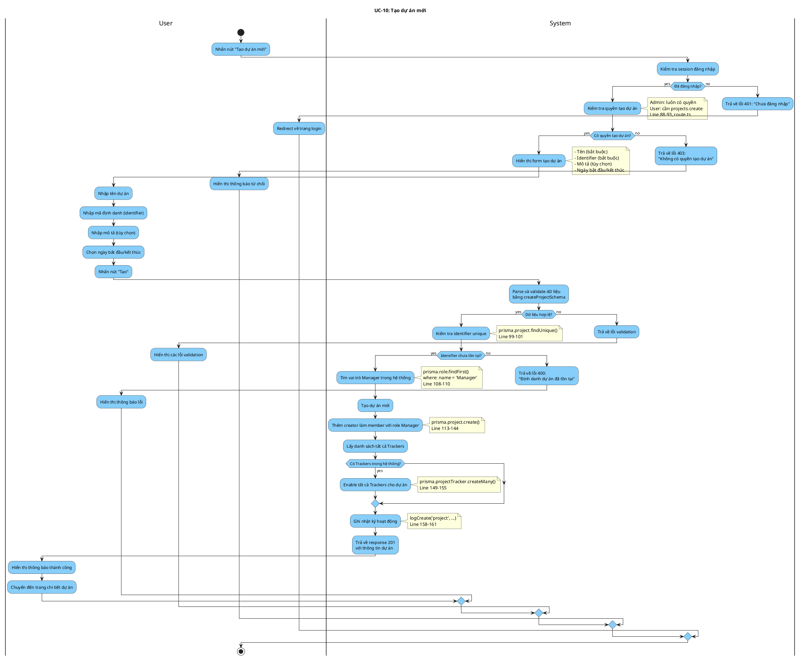

# Activity Diagram: UC-10 - Tạo dự án mới

> **Module**: Project Management  
> **Use Case ID**: UC-10  
> **Tên Use Case**: Tạo dự án mới  
> **Ngày tạo**: 2026-01-16

---

## 1. Phân tích LTOT

### 1.1. Mục đích
- Cho phép người dùng có quyền tạo dự án mới trong hệ thống

### 1.2. Actors
- **User**: Người dùng có quyền `projects.create` hoặc Administrator
- **System**: Hệ thống Worksphere

### 1.3. Kết quả có thể
- **Success**: Dự án được tạo, creator thành Manager, tất cả Trackers được enable
- **Failure**: Từ chối (không có quyền, identifier trùng, validation lỗi)

### 1.4. Các bước chính
1. User nhấn "Tạo dự án mới"
2. System hiển thị form
3. User nhập thông tin
4. System validate và kiểm tra identifier unique
5. System tạo dự án + thêm creator làm Manager
6. System enable tất cả Trackers
7. System ghi audit log

---

## 2. Activity Diagram

---

## 3. Source Code Reference

| File | Function/Method | Line | Mô tả |
|------|-----------------|------|-------|
| `src/app/api/projects/route.ts` | `POST()` | 78-166 | API tạo project |
| `src/app/api/projects/route.ts` | `checkPermission()` | 170-192 | Kiểm tra quyền |
| `src/lib/validations.ts` | `createProjectSchema` | - | Schema validation |
| `src/lib/audit-log.ts` | `logCreate()` | 158-161 | Ghi audit log |

---

## 4. Business Rules

| ID | Rule | Mô tả |
|----|------|-------|
| BR-01 | Unique Identifier | Mã định danh phải là duy nhất |
| BR-02 | Identifier Format | Chỉ chứa chữ thường, số, dấu gạch ngang |
| BR-03 | Auto Manager | Người tạo tự động thành Manager |
| BR-04 | Auto Enable Trackers | Tất cả Trackers được enable cho dự án mới |
| BR-05 | Audit Logging | Mọi thao tác tạo được ghi log |
| BR-06 | Permission Check | Admin hoặc có quyền projects.create |

---

## 5. Checklist LTOT

- [x] Có đúng 1 start
- [x] Có đúng 1 stop
- [x] Tất cả if-else đều có endif
- [x] Tất cả nhánh merge về stop chung
- [x] Swimlanes phân chia rõ User/System
- [x] Activity đặt tên bằng động từ rõ ràng
- [x] Guard conditions cụ thể, có thể test

---

*Tài liệu được tạo dựa trên phân tích mã nguồn Worksphere*  
*Ngày tạo: 2026-01-16*
