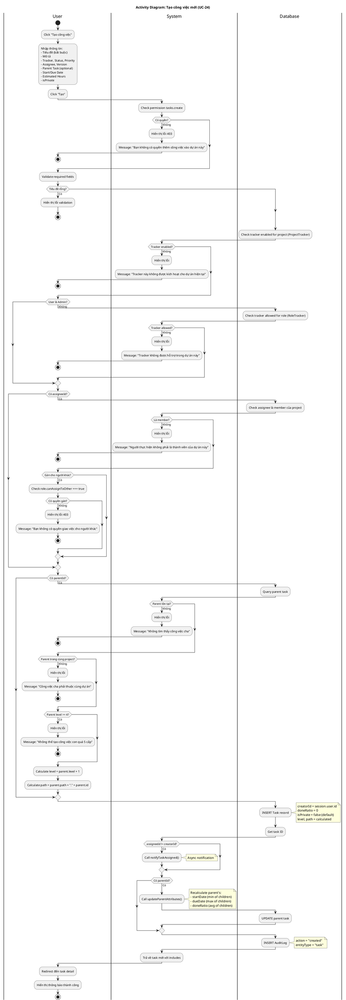

# Activity Diagram 06: Tạo công việc mới (UC-24)

> **Use Case**: UC-24 - Tạo công việc mới  
> **Module**: Task Management  
> **Phiên bản**: 1.1  
> **Ngày cập nhật**: 2026-01-16

---

## 1. Thông tin chung

| Thuộc tính | Giá trị |
|------------|---------|
| **Actors** | User |
| **Độ phức tạp** | Cao |
| **Swimlanes** | User, System, Database |
| **Đặc điểm** | Auto-number, Tracker/Assignee validation, Hierarchy, Notifications |
| **Use Case tham chiếu** | [UC-24](../usecases/06-task-management.md) |

---

## 2. Activity Diagram (PlantUML)

---

## 3. Mô tả các bước (Khớp với UC-24 Main Flow)

| # UC | # AD | Actor | Hành động | Ghi chú |
|------|------|-------|-----------|---------| 
| 1 | 1 | User | Click tạo công việc | Mở form |
| 2 | 2-3 | System | Check permission | tasks.create |
| 3 | 1 | System | Hiển thị form | Nhiều fields |
| 4 | 1 | User | Nhập và submit | Click Tạo |
| 5 | 4-5 | System | Validate tracker | ProjectTracker + RoleTracker |
| 6 | 6-7 | System | Validate assignee | Member + canAssignToOther |
| 7 | 8-11 | System | Validate parent & hierarchy | Level ≤ 4 |
| 8 | 12 | Database | Create task | INSERT |
| 9 | 13 | System | Send notification | If assignee != creator |
| 10 | 14 | Database | Write audit log | action=created |
| 11 | 15 | System | Update parent | If has parent |

---

## 4. Decision Points (Khớp với UC Exception Flows)

| # | Condition | True | False | UC Ref |
|---|-----------|------|-------|--------|
| D1 | Có quyền tasks.create? | Tiếp tục | Error 403 | E1 |
| D2 | Tracker enabled cho project? | Tiếp tục | Error | E2 |
| D3 | Tracker allowed cho role? (non-admin) | Tiếp tục | Error | E3 |
| D4 | Assignee là member? | Tiếp tục | Error | E4 |
| D5 | Có quyền gán người khác? | Tiếp tục | Error 403 | E5 |
| D6 | Parent tồn tại? | Tiếp tục | Error | E6 |
| D7 | Parent cùng project? | Tiếp tục | Error | E7 |
| D8 | Parent level < 4? | Tiếp tục | Error | E8 |

---

## 5. Business Rules (Khớp với UC-24)

| Rule | Mô tả | UC Ref |
|------|-------|--------|
| BR-01 | Cần quyền `tasks.create` | Tiền điều kiện |
| BR-02 | Tracker phải enabled trong ProjectTracker | Bước 5 |
| BR-03 | Non-admin: tracker phải có trong RoleTracker | Bước 5 |
| BR-04 | Assignee phải là member của project | Bước 6 |
| BR-05 | Gán người khác cần canAssignToOther = true | Bước 6 |
| BR-06 | Tối đa 5 cấp hierarchy (level 0-4) | Bước 7 |
| BR-07 | Subtask cập nhật parent attributes | Bước 11 |
| BR-08 | Notification cho assignee khác creator | Bước 9 |

---

*Cập nhật: 2026-01-16 - Đồng bộ hoàn toàn với UC-24*
