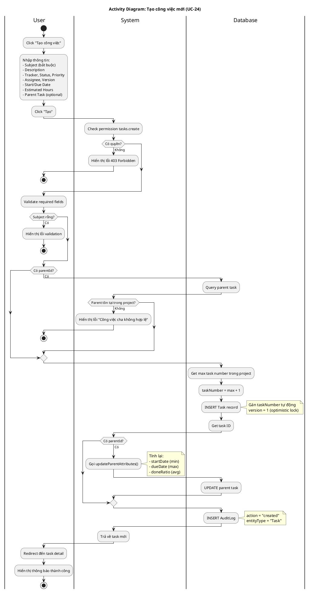

# Activity Diagram 06: Tạo công việc mới (UC-24)

> **Use Case**: UC-24 - Tạo công việc mới  
> **Module**: Task Management  
> **Ngày**: 2026-01-15

---

## 1. Thông tin chung

| Thuộc tính | Giá trị |
|------------|---------|
| **Actors** | User |
| **Độ phức tạp** | Cao |
| **Swimlanes** | User, System, Database |
| **Đặc điểm** | Auto-generate number, Subtask logic, Update parent |

---

## 2. Activity Diagram (PlantUML)

---

## 3. Mô tả các bước

| # | Actor | Hành động | Ghi chú |
|---|-------|-----------|---------|
| 1 | User | Click tạo công việc | Mở form |
| 2 | User | Nhập thông tin | Nhiều fields |
| 3 | System | Check permission | tasks.create |
| 4 | System | Validate required | subject |
| 5 | System | Validate parent | If parentId exists |
| 6 | Database | Generate task number | Max + 1 |
| 7 | Database | Create task | INSERT |
| 8 | System | Update parent | If subtask |
| 9 | Database | Create audit log | Log change |
| 10 | User | View task | Redirect |

---

## 4. Business Rules

| Rule | Mô tả |
|------|-------|
| BR-01 | Task number auto-increment per project |
| BR-02 | Subtask = Task có parentId |
| BR-03 | Tạo subtask → Update parent attributes |
| BR-04 | Version bắt đầu = 1 (optimistic lock) |

---

*Ngày tạo: 2026-01-15*
