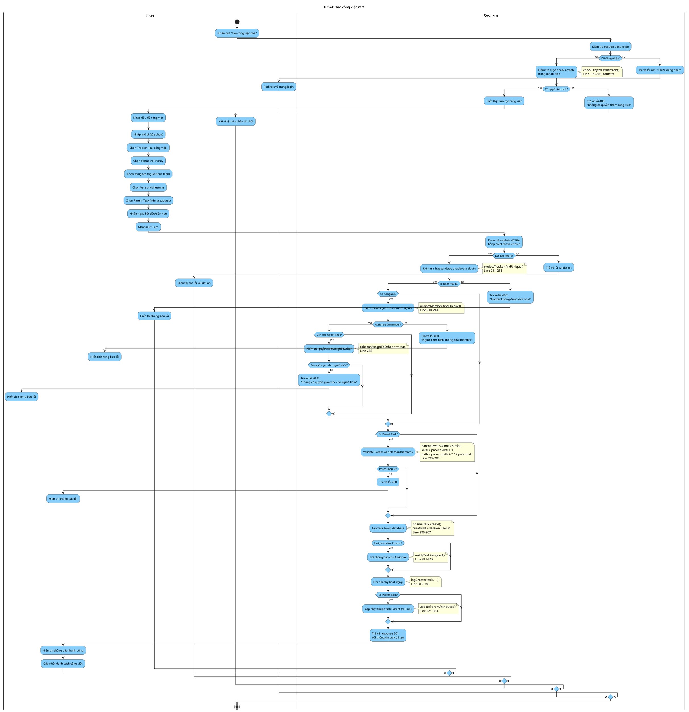

# Activity Diagram: UC-24 - Tạo công việc mới

> **Module**: Task Management  
> **Use Case ID**: UC-24  
> **Tên Use Case**: Tạo công việc mới  
> **Ngày tạo**: 2026-01-16

---

## 1. Phân tích LTOT

### 1.1. Mục đích
- Cho phép người dùng có quyền tạo công việc mới (task/subtask) trong dự án

### 1.2. Actors
- **User**: Thành viên dự án có quyền `tasks.create`
- **System**: Hệ thống Worksphere

### 1.3. Kết quả có thể
- **Success**: Task được tạo, thông báo gửi cho assignee, audit log
- **Failure**: Từ chối (không có quyền, tracker/assignee invalid, vượt max depth)

### 1.4. Các bước chính
1. User nhấn "Tạo công việc"
2. System kiểm tra quyền tasks.create
3. User nhập thông tin
4. System validate tracker, assignee, parent
5. System tạo task với hierarchy
6. System gửi thông báo cho assignee
7. System cập nhật parent attributes

---

## 2. Activity Diagram

---

## 3. Source Code Reference

| File | Function/Method | Line | Mô tả |
|------|-----------------|------|-------|
| `src/app/api/tasks/route.ts` | `POST()` | 190-330 | API tạo task |
| `src/lib/permissions.ts` | `checkProjectPermission()` | - | Kiểm tra quyền trong dự án |
| `src/lib/notifications.ts` | `notifyTaskAssigned()` | - | Gửi thông báo |
| `src/lib/services/task-service.ts` | `updateParentAttributes()` | - | Cập nhật parent roll-up |

---

## 4. Business Rules

| ID | Rule | Mô tả |
|----|------|-------|
| BR-01 | Permission Required | Cần quyền tasks.create trong dự án |
| BR-02 | Valid Tracker | Tracker phải được enable cho dự án |
| BR-03 | Assignee is Member | Người được gán phải là member dự án |
| BR-04 | canAssignToOther | Gán cho người khác cần quyền đặc biệt |
| BR-05 | Max Depth 5 | Hierarchy tối đa 5 cấp (level 0-4) |
| BR-06 | Same Project | Parent và child phải cùng dự án |
| BR-07 | Auto Notification | Tự động thông báo cho assignee mới |
| BR-08 | Roll-up Update | Tự động cập nhật parent attributes |

---

## 5. Checklist LTOT

- [x] Có đúng 1 start
- [x] Có đúng 1 stop chính
- [x] Dùng detach cho các lỗi nghiêm trọng cần thoát sớm
- [x] Tất cả if-else đều có endif
- [x] Swimlanes phân chia rõ User/System
- [x] Activity đặt tên bằng động từ rõ ràng
- [x] Guard conditions cụ thể, có thể test

---

*Tài liệu được tạo dựa trên phân tích mã nguồn Worksphere*  
*Ngày tạo: 2026-01-16*
