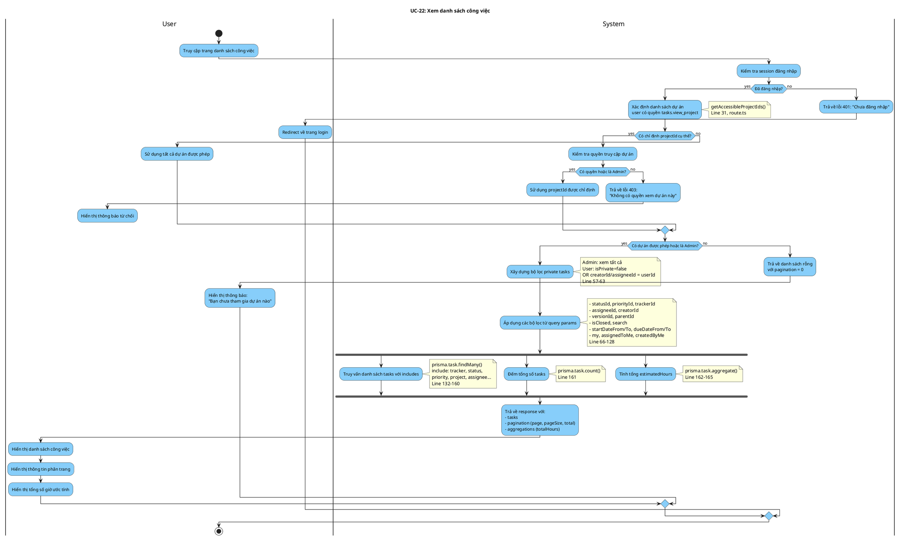

# Activity Diagram: UC-22 - Xem danh sách công việc

> **Module**: Task Management  
> **Use Case ID**: UC-22  
> **Tên Use Case**: Xem danh sách công việc  
> **Ngày tạo**: 2026-01-16

---

## 1. Phân tích LTOT

### 1.1. Mục đích
- Cho phép người dùng xem danh sách công việc với filter, search, pagination

### 1.2. Actors
- **User**: Thành viên dự án có quyền `tasks.view_project`
- **System**: Hệ thống Worksphere

### 1.3. Kết quả có thể
- **Success**: Danh sách tasks với pagination và aggregations
- **Failure**: Danh sách rỗng hoặc lỗi quyền

### 1.4. Các bước chính
1. User truy cập trang danh sách
2. System xác định dự án được phép xem
3. System áp dụng bộ lọc
4. System truy vấn và trả về danh sách

---

## 2. Activity Diagram

---

## 3. Source Code Reference

| File | Function/Method | Line | Mô tả |
|------|-----------------|------|-------|
| `src/app/api/tasks/route.ts` | `GET()` | 16-183 | API lấy danh sách tasks |
| `src/lib/permissions.ts` | `getAccessibleProjectIds()` | - | Lấy danh sách dự án được phép |

---

## 4. Business Rules

| ID | Rule | Mô tả |
|----|------|-------|
| BR-01 | Permission View | Quyền tasks.view_project quyết định dự án nào được xem |
| BR-02 | Private Task | Task riêng tư chỉ hiện cho creator/assignee (trừ admin) |
| BR-03 | Max Page Size | Kích thước trang tối đa 100 tasks |
| BR-04 | Default Sort | Sắp xếp mặc định theo updatedAt desc |

---

## 5. Checklist LTOT

- [x] Có đúng 1 start
- [x] Có đúng 1 stop chính
- [x] Dùng detach cho lỗi quyền cần thoát sớm
- [x] Fork/Join cho truy vấn song song
- [x] Swimlanes phân chia rõ User/System
- [x] Activity đặt tên bằng động từ rõ ràng

---

*Tài liệu được tạo dựa trên phân tích mã nguồn Worksphere*  
*Ngày tạo: 2026-01-16*
