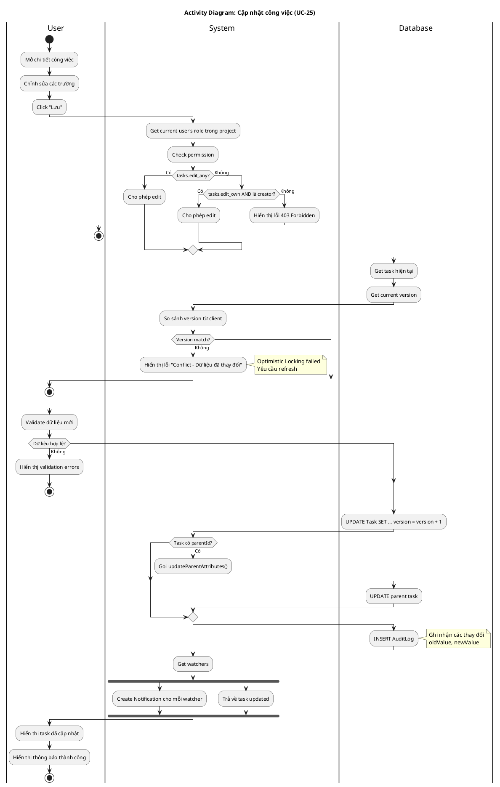

# Activity Diagram 07: Cập nhật công việc (UC-25)

> **Use Case**: UC-25 - Cập nhật công việc  
> **Module**: Task Management  
> **Ngày**: 2026-01-15

---

## 1. Thông tin chung

| Thuộc tính | Giá trị |
|------------|---------|
| **Actors** | User |
| **Độ phức tạp** | Cao |
| **Swimlanes** | User, System, Database |
| **Đặc điểm** | Optimistic Locking, Update parent, Notify watchers |

---

## 2. Activity Diagram (PlantUML)



---

## 3. Optimistic Locking Flow

```
Client gửi: { id, data, version: 5 }
                    ↓
Server check: SELECT version FROM Task WHERE id = ?
                    ↓
            version = 5? ──→ UPDATE ... version = 6
                    ↓
            version ≠ 5? ──→ Return 409 Conflict
```

---

## 4. Permission Matrix

| Quyền | Điều kiện | Kết quả |
|-------|-----------|---------|
| tasks.edit_any | Có quyền | Cho phép |
| tasks.edit_own | Là creator | Cho phép |
| Không có quyền | - | 403 Forbidden |

---

## 5. Business Rules

| Rule | Mô tả |
|------|-------|
| BR-01 | Optimistic locking bằng version field |
| BR-02 | Version tự động tăng khi update |
| BR-03 | Update subtask → Recalculate parent |
| BR-04 | Notify watchers khi có thay đổi |

---

*Ngày tạo: 2026-01-15*
