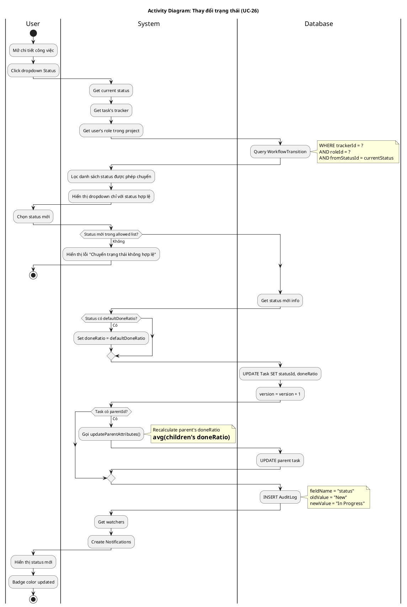

# Activity Diagram 08: Thay đổi trạng thái (UC-26)

> **Use Case**: UC-26 - Thay đổi trạng thái  
> **Module**: Task Management  
> **Ngày**: 2026-01-15

---

## 1. Thông tin chung

| Thuộc tính | Giá trị |
|------------|---------|
| **Actors** | User |
| **Độ phức tạp** | Cao |
| **Swimlanes** | User, System, Database |
| **Đặc điểm** | **Workflow Validation**, Update parent, Notify watchers |

---

## 2. Activity Diagram (PlantUML)



---

## 3. Workflow Validation

```
WorkflowTransition Table:
┌───────────┬────────┬──────────────┬────────────┐
│ trackerId │ roleId │ fromStatusId │ toStatusId │
├───────────┼────────┼──────────────┼────────────┤
│ Bug       │ Dev    │ New          │ InProgress │
│ Bug       │ Dev    │ InProgress   │ Resolved   │
│ Bug       │ QA     │ Resolved     │ Closed     │
│ Bug       │ QA     │ Resolved     │ Reopened   │
└───────────┴────────┴──────────────┴────────────┘
```

---

## 4. Decision Points

| # | Condition | True | False |
|---|-----------|------|-------|
| D1 | Status trong allowed list? | Tiếp tục | Lỗi transition |
| D2 | defaultDoneRatio defined? | Set doneRatio | Keep current |
| D3 | Có parentId? | Update parent | Skip |

---

## 5. Business Rules

| Rule | Mô tả |
|------|-------|
| BR-01 | **Transition phải được định nghĩa trong WorkflowTransition** |
| BR-02 | Transition phụ thuộc vào: tracker + role + fromStatus |
| BR-03 | defaultDoneRatio tự động set khi chuyển status |
| BR-04 | Parent's doneRatio = avg của children |

---

*Ngày tạo: 2026-01-15*
