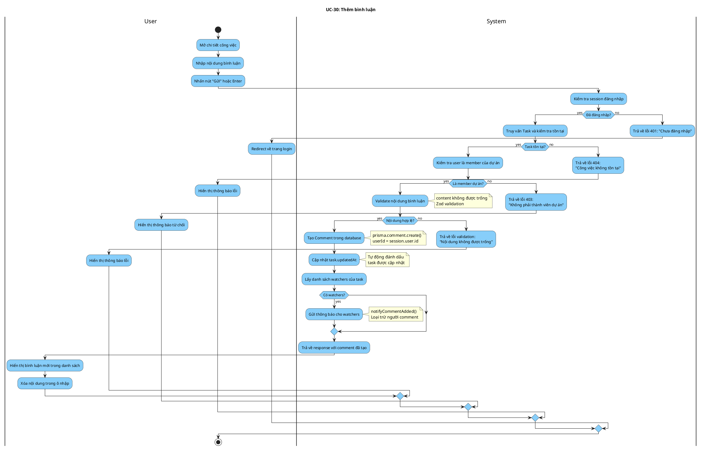

# Activity Diagram: UC-30 - Thêm bình luận

> **Module**: Comments  
> **Use Case ID**: UC-30  
> **Tên Use Case**: Thêm bình luận  
> **Ngày tạo**: 2026-01-16

---

## 1. Phân tích LTOT

### 1.1. Mục đích
- Cho phép thành viên dự án thêm bình luận vào công việc

### 1.2. Actors
- **User**: Thành viên của dự án chứa công việc
- **System**: Hệ thống Worksphere

### 1.3. Kết quả có thể
- **Success**: Comment được tạo, task được cập nhật, watchers nhận thông báo
- **Failure**: Từ chối (không có quyền, task không tồn tại)

### 1.4. Các bước chính
1. User nhập nội dung bình luận
2. User gửi bình luận
3. System validate và tạo comment
4. System cập nhật task.updatedAt
5. System gửi thông báo cho watchers

---

## 2. Activity Diagram

---

## 3. Source Code Reference

| File | Function/Method | Line | Mô tả |
|------|-----------------|------|-------|
| `src/app/api/tasks/[id]/comments/route.ts` | `POST()` | - | API tạo comment |
| `src/lib/notifications.ts` | `notifyCommentAdded()` | - | Gửi thông báo cho watchers |

---

## 4. Business Rules

| ID | Rule | Mô tả |
|----|------|-------|
| BR-01 | Member Only | Chỉ member dự án mới được comment |
| BR-02 | Auto Update | Task.updatedAt được cập nhật khi có comment mới |
| BR-03 | Notify Watchers | Tự động thông báo cho watchers (trừ người comment) |
| BR-04 | Non-Empty | Nội dung comment không được trống |

---

## 5. Checklist LTOT

- [x] Có đúng 1 start
- [x] Có đúng 1 stop
- [x] Tất cả if-else đều có endif
- [x] Các nhánh error merge về stop chung
- [x] Swimlanes phân chia rõ User/System
- [x] Activity đặt tên bằng động từ rõ ràng

---

*Tài liệu được tạo dựa trên phân tích mã nguồn Worksphere*  
*Ngày tạo: 2026-01-16*
