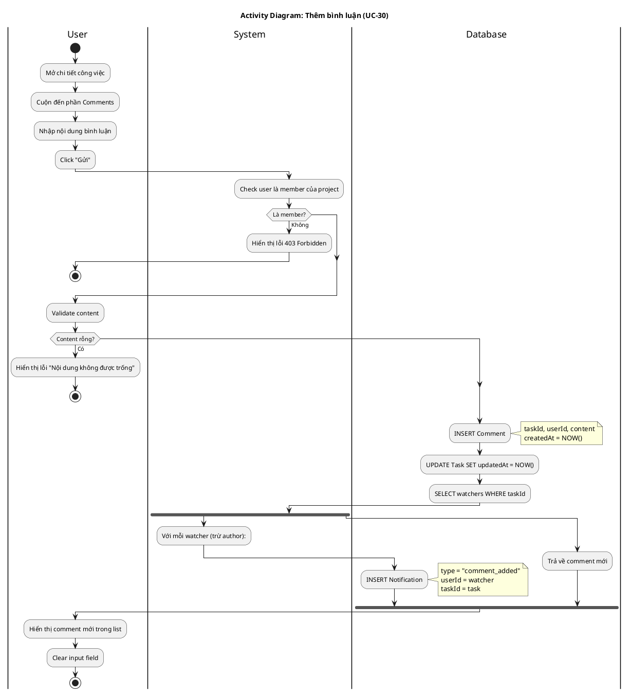

# Activity Diagram 09: Thêm bình luận (UC-30)

> **Use Case**: UC-30 - Thêm bình luận  
> **Module**: Comments  
> **Ngày**: 2026-01-15

---

## 1. Thông tin chung

| Thuộc tính | Giá trị |
|------------|---------|
| **Actors** | User |
| **Độ phức tạp** | Trung bình |
| **Swimlanes** | User, System, Database |
| **Đặc điểm** | Parallel notification |

---

## 2. Activity Diagram (PlantUML)

---

## 3. Mô tả các bước

| # | Actor | Hành động | Ghi chú |
|---|-------|-----------|---------|
| 1 | User | Mở task detail | - |
| 2 | User | Nhập comment | Required |
| 3 | System | Check membership | Project member |
| 4 | System | Validate content | Not empty |
| 5 | Database | Create comment | INSERT |
| 6 | Database | Update task.updatedAt | Touch task |
| 7 | Database | Get watchers | List |
| 8 | System | Create notifications | Parallel |
| 9 | User | View comment | Realtime |

---

## 4. Business Rules

| Rule | Mô tả |
|------|-------|
| BR-01 | Chỉ project member mới được comment |
| BR-02 | Comment tự động update task.updatedAt |
| BR-03 | Notify cho watchers (trừ author) |
| BR-04 | Comment không thể rỗng |

---

*Ngày tạo: 2026-01-15*
