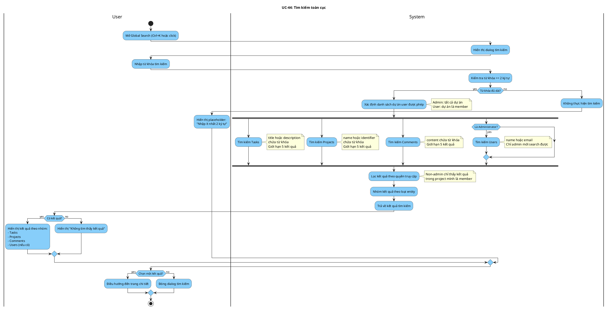

# Activity Diagram: UC-44 - Tìm kiếm toàn cục

> **Module**: Global Search  
> **Use Case ID**: UC-44  
> **Tên Use Case**: Tìm kiếm toàn cục  
> **Ngày tạo**: 2026-01-16

---

## 1. Phân tích LTOT

### 1.1. Mục đích
- Cho phép người dùng tìm kiếm trong toàn hệ thống (tasks, projects, comments, users)

### 1.2. Actors
- **User**: Người dùng đã đăng nhập
- **System**: Hệ thống Worksphere

### 1.3. Kết quả có thể
- **Success**: Kết quả tìm kiếm theo từng loại entity
- **Failure**: Không tìm thấy kết quả

### 1.4. Các bước chính
1. User nhập từ khóa tìm kiếm
2. System tìm kiếm song song trên các entity
3. System lọc kết quả theo quyền
4. System trả về kết quả grouped by type

---

## 2. Activity Diagram

---

## 3. Source Code Reference

| File | Function/Method | Line | Mô tả |
|------|-----------------|------|-------|
| `src/app/api/search/route.ts` | `GET()` | - | API tìm kiếm toàn cục |
| `src/components/layout/global-search.tsx` | - | - | Component Global Search dialog |

---

## 4. Business Rules

| ID | Rule | Mô tả |
|----|------|-------|
| BR-01 | Min Query Length | Từ khóa tối thiểu 2 ký tự |
| BR-02 | Permission Filter | Non-admin chỉ thấy kết quả trong project là member |
| BR-03 | User Search Admin Only | Chỉ admin mới search được users |
| BR-04 | Result Limit | Mỗi loại entity giới hạn 5 kết quả |

---

## 5. Checklist LTOT

- [x] Có đúng 1 start
- [x] Có đúng 1 stop
- [x] Fork/Join cho tìm kiếm song song
- [x] Tất cả if-else đều có endif
- [x] Swimlanes phân chia rõ User/System
- [x] Activity đặt tên bằng động từ rõ ràng

---

*Tài liệu được tạo dựa trên phân tích mã nguồn Worksphere*  
*Ngày tạo: 2026-01-16*
