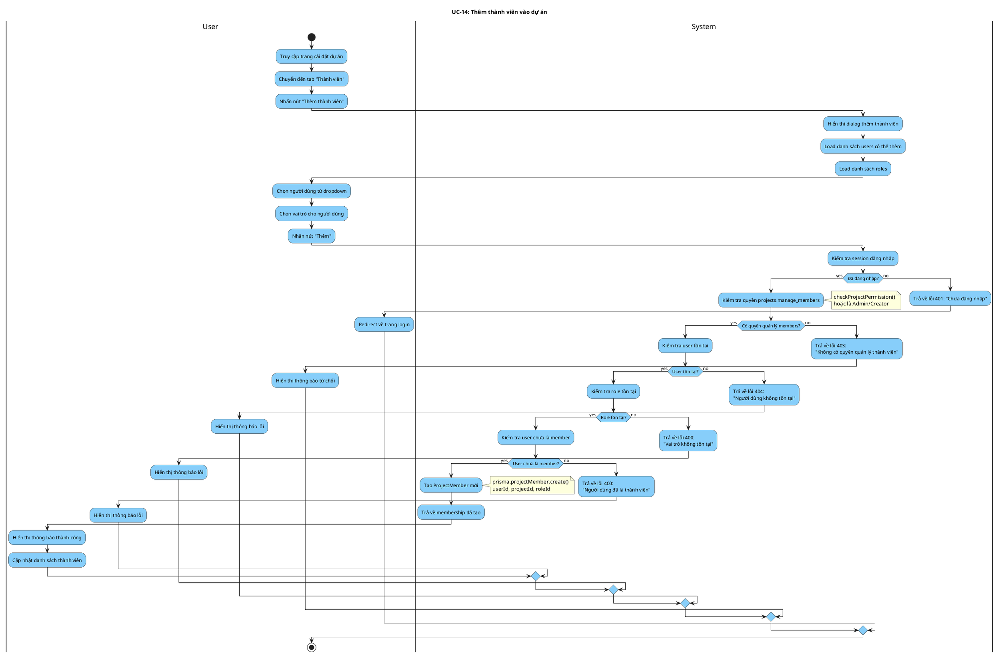

# Activity Diagram: UC-14 - Thêm thành viên vào dự án

> **Module**: Project Members  
> **Use Case ID**: UC-14  
> **Tên Use Case**: Thêm thành viên vào dự án  
> **Ngày tạo**: 2026-01-16

---

## 1. Phân tích LTOT

### 1.1. Mục đích
- Cho phép người có quyền thêm người dùng vào dự án với vai trò được chọn

### 1.2. Actors
- **User**: Người có quyền `projects.manage_members`
- **System**: Hệ thống Worksphere

### 1.3. Kết quả có thể
- **Success**: Member được thêm vào dự án với role tương ứng
- **Failure**: Từ chối (không có quyền, user không tồn tại, đã là member)

### 1.4. Các bước chính
1. User chọn người dùng cần thêm
2. User chọn vai trò
3. System kiểm tra quyền và validation
4. System tạo membership
5. Trả về kết quả

---

## 2. Activity Diagram

---

## 3. Source Code Reference

| File | Function/Method | Line | Mô tả |
|------|-----------------|------|-------|
| `src/app/api/projects/[id]/members/route.ts` | `POST()` | - | API thêm member |
| `src/lib/permissions.ts` | `checkProjectPermission()` | - | Kiểm tra quyền |

---

## 4. Business Rules

| ID | Rule | Mô tả |
|----|------|-------|
| BR-01 | Permission Required | Cần quyền projects.manage_members hoặc là Admin/Creator |
| BR-02 | Valid User | User phải tồn tại trong hệ thống |
| BR-03 | Valid Role | Role phải tồn tại trong hệ thống |
| BR-04 | Not Already Member | User chưa là member của dự án |

---

## 5. Checklist LTOT

- [x] Có đúng 1 start
- [x] Có đúng 1 stop
- [x] Tất cả if-else đều có endif
- [x] Các nhánh error merge về stop chung
- [x] Swimlanes phân chia rõ User/System
- [x] Activity đặt tên bằng động từ rõ ràng

---

*Tài liệu được tạo dựa trên phân tích mã nguồn Worksphere*  
*Ngày tạo: 2026-01-16*
