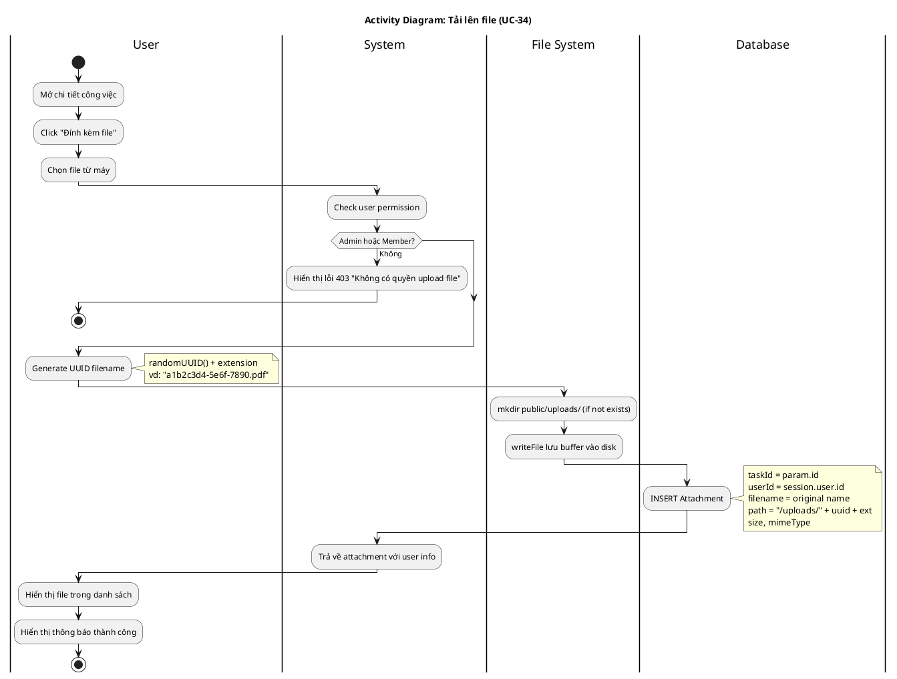

# Activity Diagram 10: Tải lên file (UC-34)

> **Use Case**: UC-34 - Tải lên file  
> **Module**: Attachments  
> **Ngày**: 2026-01-15

---

## 1. Thông tin chung

| Thuộc tính | Giá trị |
|------------|---------|
| **Actors** | User |
| **Độ phức tạp** | Trung bình |
| **Swimlanes** | User, System, File System, Database |

---

## 2. Activity Diagram (PlantUML)

---

## 3. Mô tả các bước

| # | Actor | Hành động | Ghi chú |
|---|-------|-----------|---------|
| 1 | User | Click đính kèm | Open file picker |
| 2 | User | Chọn file | From disk |
| 3 | System | Validate size | < 10MB |
| 4 | System | Validate type | Allowed types |
| 5 | System | Generate UUID | Unique filename |
| 6 | File System | Save file | public/uploads/ |
| 7 | Database | Create record | Metadata |
| 8 | User | View file | In list |

---

## 4. Implementation Notes

| Đặc điểm | Giá trị | Ghi chú |
|----------|---------|---------|
| UUID filename | randomUUID() + ext | Tránh trùng tên |
| Storage path | /public/uploads/ | Relative URL |
| Permission | Admin OR Member | Kiểm tra trước upload |

**⚠️ Lưu ý**: Code hiện tại KHÔNG có validation size/type ở server-side. Có thể cần bổ sung sau.

---

## 5. Business Rules

| Rule | Mô tả |
|------|-------|
| BR-01 | File lưu với UUID để tránh conflict |
| BR-02 | Lưu original filename trong DB |
| BR-03 | Chỉ uploader hoặc Admin được xóa |

---

*Ngày tạo: 2026-01-15*
