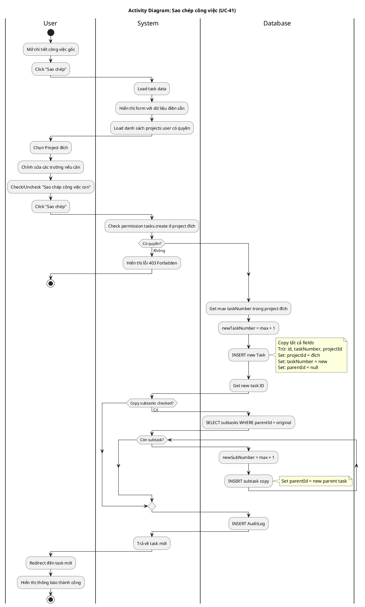

# Activity Diagram 11: Sao chép công việc (UC-41)

> **Use Case**: UC-41 - Sao chép công việc  
> **Module**: Task Copy  
> **Ngày**: 2026-01-15

---

## 1. Thông tin chung

| Thuộc tính | Giá trị |
|------------|---------|
| **Actors** | User |
| **Độ phức tạp** | Cao |
| **Swimlanes** | User, System, Database |
| **Đặc điểm** | Recursive copy subtasks, Cross-project |

---

## 2. Activity Diagram (PlantUML)

---

## 3. Mô tả các bước

| # | Actor | Hành động | Ghi chú |
|---|-------|-----------|---------|
| 1 | User | Click sao chép | Mở form |
| 2 | System | Load data | Prefill form |
| 3 | User | Chọn project đích | Dropdown |
| 4 | User | Chỉnh sửa fields | Optional |
| 5 | User | Check copy subtasks | Optional |
| 6 | System | Check permission | tasks.create |
| 7 | Database | Generate number | New project |
| 8 | Database | Create task | Copy |
| 9 | Database | Create subtasks | If checked |
| 10 | User | View new task | Redirect |

---

## 4. Copy Rules

| Field | Behavior |
|-------|----------|
| id | Generate new |
| taskNumber | Generate new (per project) |
| projectId | Set to target project |
| parentId | null (for main), new parent ID (for subtask) |
| createdAt | NOW() |
| version | 1 (reset) |
| Other fields | Copy as-is |

---

## 5. Business Rules

| Rule | Mô tả |
|------|-------|
| BR-01 | Có thể copy sang project khác |
| BR-02 | Task number mới theo project đích |
| BR-03 | Subtasks được copy recursive nếu chọn |
| BR-04 | Cần quyền tasks.create ở project đích |

---

*Ngày tạo: 2026-01-15*
