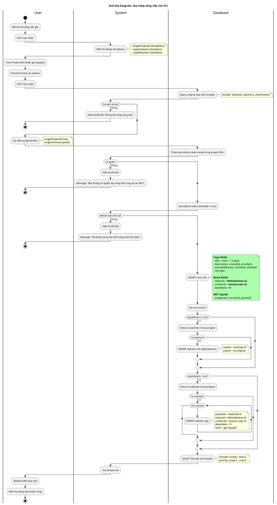

# Activity Diagram 11: Sao chép công việc (UC-41)

> **Use Case**: UC-41 - Sao chép công việc  
> **Module**: Task Copy  
> **Phiên bản**: 1.1  
> **Ngày cập nhật**: 2026-01-16

---

## 1. Thông tin chung

| Thuộc tính | Giá trị |
|------------|---------|
| **Actors** | User |
| **Độ phức tạp** | Cao |
| **Swimlanes** | User, System, Database |
| **Đặc điểm** | Cross-project, Copy watchers, Copy subtasks |
| **Use Case tham chiếu** | [UC-41](../usecases/10-task-copy.md) |

---

## 2. Activity Diagram (PlantUML)

---

## 3. Copy Rules (Khớp với UC-41)

| Field | Behavior | UC Ref |
|-------|----------|--------|
| title | + " (Copy)" | Bước 9 |
| description | Copy as-is | Bước 9 |
| trackerId | Copy as-is | Bước 9 |
| **statusId** | **Reset to default** | Bước 9 |
| priorityId | Copy as-is | Bước 9 |
| projectId | Target project | Bước 6 |
| **creatorId** | **session.user.id** | Bước 9 |
| assigneeId | **NOT copied** | Ghi chú |
| versionId | **NOT copied** | Ghi chú |
| estimatedHours | Copy as-is | Bước 9 |
| **doneRatio** | **Reset to 0** | Bước 9 |
| startDate, dueDate | Copy as-is | Bước 9 |
| isPrivate | Copy as-is | Bước 9 |
| parentId | null (for main task) | Ghi chú |

---

## 4. Decision Points (Khớp với UC Exception Flows)

| # | Condition | True | False | UC Ref |
|---|-----------|------|-------|--------|
| D1 | Task gốc tồn tại? | Tiếp tục | Error 404 | E1 |
| D2 | Có quyền tasks.create? | Tiếp tục | Error 403 | E2 |
| D3 | Default status tồn tại? | Tiếp tục | Error 500 | E3 |
| D4 | copyWatchers = true? | Copy watchers | Skip | Bước 10 |
| D5 | copySubtasks = true? | Copy subtasks | Skip | Bước 11 |

---

## 5. Business Rules (Khớp với UC-41)

| Rule | Mô tả | UC Ref |
|------|-------|--------|
| BR-01 | Permission check `tasks.create` ở project đích | BR-01 |
| BR-02 | Title thêm hậu tố " (Copy)" | BR-02 |
| BR-03 | Status reset về default | BR-03 |
| BR-04 | doneRatio reset về 0 | BR-04 |
| BR-05 | creatorId là người thực hiện copy | BR-05 |
| BR-06 | assigneeId, versionId KHÔNG copy | BR-06, BR-07 |
| BR-07 | Subtasks link với parentId = newTask.id | BR-09 |

---

*Cập nhật: 2026-01-16 - Đồng bộ hoàn toàn với UC-41*
