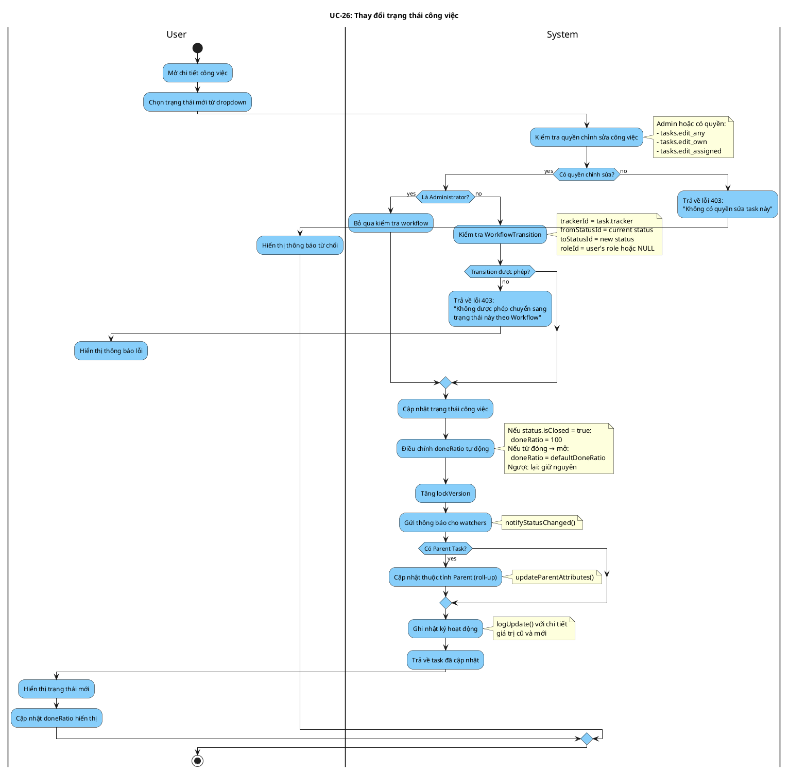

# Activity Diagram: UC-26 - Thay đổi trạng thái công việc

> **Module**: Task Management  
> **Use Case ID**: UC-26  
> **Tên Use Case**: Thay đổi trạng thái  
> **Ngày tạo**: 2026-01-16

---

## 1. Phân tích LTOT

### 1.1. Mục đích
- Cho phép người dùng thay đổi trạng thái công việc theo các chuyển đổi được phép trong Workflow

### 1.2. Actors
- **User**: Người có quyền chỉnh sửa công việc
- **System**: Hệ thống Worksphere

### 1.3. Kết quả có thể
- **Success**: Status được cập nhật, doneRatio tự động điều chỉnh
- **Failure**: Từ chối theo workflow

### 1.4. Các bước chính
1. User chọn trạng thái mới
2. System kiểm tra workflow transition
3. System cập nhật status và doneRatio
4. System gửi thông báo cho watchers
5. System cập nhật parent attributes

---

## 2. Activity Diagram

---

## 3. Source Code Reference

| File | Function/Method | Line | Mô tả |
|------|-----------------|------|-------|
| `src/app/api/tasks/[id]/route.ts` | `PUT()` | - | API cập nhật task |
| `src/lib/services/task-service.ts` | `updateParentAttributes()` | - | Cập nhật parent roll-up |

---

## 4. Business Rules

| ID | Rule | Mô tả |
|----|------|-------|
| BR-01 | Workflow Required | Chuyển status phải theo WorkflowTransition |
| BR-02 | Admin Bypass | Admin bỏ qua kiểm tra workflow |
| BR-03 | Auto DoneRatio | Status đóng → doneRatio = 100% |
| BR-04 | Reopen Reset | Mở lại task đóng → reset doneRatio |
| BR-05 | Notify Watchers | Tự động thông báo khi status thay đổi |

---

## 5. Checklist LTOT

- [x] Có đúng 1 start
- [x] Có đúng 1 stop chính
- [x] Dùng detach cho lỗi workflow cần thoát sớm
- [x] Tất cả if-else đều có endif
- [x] Swimlanes phân chia rõ User/System
- [x] Activity đặt tên bằng động từ rõ ràng

---

*Tài liệu được tạo dựa trên phân tích mã nguồn Worksphere*  
*Ngày tạo: 2026-01-16*
