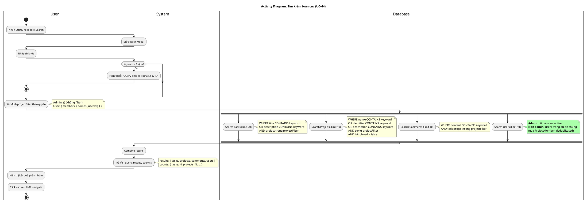

# Activity Diagram 12: Tìm kiếm toàn cục (UC-44)

> **Use Case**: UC-44 - Tìm kiếm toàn cục  
> **Module**: Global Search  
> **Phiên bản**: 1.1  
> **Ngày cập nhật**: 2026-01-16

---

## 1. Thông tin chung

| Thuộc tính | Giá trị |
|------------|---------|
| **Actors** | User |
| **Độ phức tạp** | Trung bình |
| **Swimlanes** | User, System, Database |
| **Đặc điểm** | Parallel search 4 types, Permission filter |
| **Use Case tham chiếu** | [UC-44](../usecases/12-global-search.md) |

---

## 2. Activity Diagram (PlantUML)



---

## 3. Parallel Search (Khớp với UC-44 Bước 5)

| Entity | Fields | Limit | Permission Filter |
|--------|--------|-------|-------------------|
| Tasks | title, description | **20** | project trong projectFilter |
| Projects | name, identifier, description | 10 | trong projectFilter, isArchived=false |
| Comments | content | 10 | task.project trong projectFilter |
| Users | name, email | 10 | **Xem chi tiết bên dưới** |

---

## 4. User Search Logic (Khớp với UC-44)

```
Admin:
  ├── Query tất cả users có isActive = true
  └── No filter

Non-Admin:
  ├── Query ProjectMember trong các dự án user là thành viên
  ├── Lấy users qua relation
  ├── Filter: user.name CONTAINS hoặc user.email CONTAINS
  └── Deduplicate by userId (Map)
```

**Lưu ý quan trọng**: Non-admin VẪN search được users, chỉ là giới hạn trong scope dự án chung (KHÔNG phải loại bỏ hoàn toàn kết quả users).

---

## 5. Decision Points (Khớp với UC Exception Flows)

| # | Condition | True | False | UC Ref |
|---|-----------|------|-------|--------|
| D1 | Keyword < 2 ký tự? | Error 400 | Tiếp tục | E1 |

---

## 6. Business Rules (Khớp với UC-44)

| Rule | Mô tả | UC Ref |
|------|-------|--------|
| BR-01 | Min query length = 2 ký tự | BR-01 |
| BR-02 | Admin xem tất cả | BR-02 |
| BR-03 | Non-admin giới hạn trong dự án là member | BR-03 |
| BR-04 | Tasks limit = 20, others = 10 | BR-04, BR-05 |
| BR-05 | Non-admin users search = trong dự án chung | BR-06 |
| BR-06 | Chỉ search users có isActive = true | BR-07 |
| BR-07 | Chỉ search projects có isArchived = false | BR-08 |

---

## 7. Response Structure

```json
{
  "query": "keyword",
  "results": {
    "tasks": [...],      // max 20
    "projects": [...],   // max 10
    "comments": [...],   // max 10
    "users": [...]       // max 10
  },
  "counts": {
    "tasks": 5,
    "projects": 2,
    "comments": 3,
    "users": 1
  }
}
```

---

*Cập nhật: 2026-01-16 - Đồng bộ hoàn toàn với UC-44*
