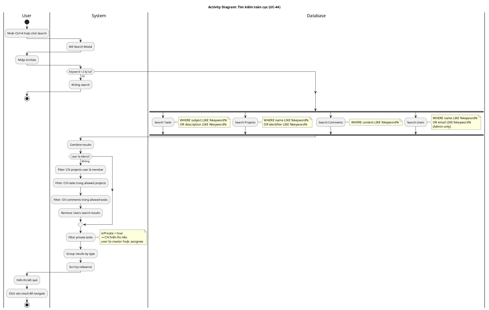

# Activity Diagram 12: Tìm kiếm toàn cục (UC-44)

> **Use Case**: UC-44 - Tìm kiếm toàn cục  
> **Module**: Global Search  
> **Ngày**: 2026-01-15

---

## 1. Thông tin chung

| Thuộc tính | Giá trị |
|------------|---------|
| **Actors** | User |
| **Độ phức tạp** | Trung bình |
| **Swimlanes** | User, System, Database |
| **Đặc điểm** | Parallel search, Permission filter |

---

## 2. Activity Diagram (PlantUML)



---

## 3. Parallel Search

| Entity | Fields | Permission |
|--------|--------|------------|
| Tasks | subject, description | Project member |
| Projects | name, identifier | Is member |
| Comments | content | Task accessible |
| Users | name, email | Admin only |

---

## 4. Permission Filtering

```
User (non-admin):
  ├── Get user's projects (as member)
  ├── Filter tasks by projectId IN userProjects
  ├── Filter comments by task.projectId IN userProjects
  ├── Filter private tasks: creator = user OR assignee = user
  └── Remove users from results

Admin:
  └── No filtering (see all)
```

---

## 5. Business Rules

| Rule | Mô tả |
|------|-------|
| BR-01 | Minimum 2 characters to search |
| BR-02 | Non-admin chỉ thấy projects là member |
| BR-03 | Private tasks chỉ cho creator/assignee |
| BR-04 | User search chỉ Admin được thấy |

---

*Ngày tạo: 2026-01-15*
