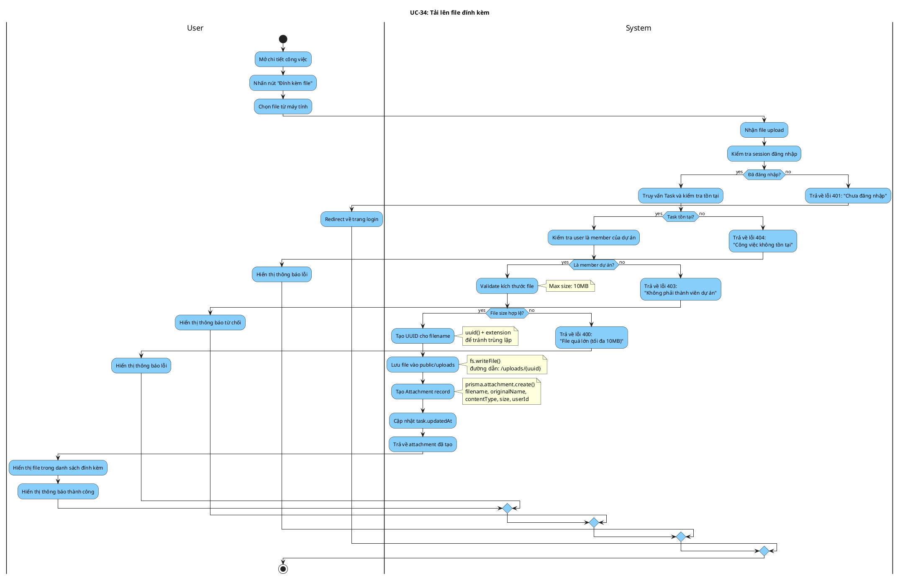

# Activity Diagram: UC-34 - Tải lên file đính kèm

> **Module**: Attachments  
> **Use Case ID**: UC-34  
> **Tên Use Case**: Tải lên file  
> **Ngày tạo**: 2026-01-16

---

## 1. Phân tích LTOT

### 1.1. Mục đích
- Cho phép thành viên dự án upload file đính kèm vào công việc

### 1.2. Actors
- **User**: Thành viên của dự án chứa công việc
- **System**: Hệ thống Worksphere

### 1.3. Kết quả có thể
- **Success**: File được lưu với tên UUID, metadata được tạo
- **Failure**: Từ chối (không có quyền, file quá lớn, loại file không hợp lệ)

### 1.4. Các bước chính
1. User chọn file để upload
2. System validate file (size, type)
3. System tạo UUID filename
4. System lưu file vào public/uploads
5. System tạo Attachment record

---

## 2. Activity Diagram

---

## 3. Source Code Reference

| File | Function/Method | Line | Mô tả |
|------|-----------------|------|-------|
| `src/app/api/tasks/[id]/attachments/route.ts` | `POST()` | - | API upload attachment |

---

## 4. Business Rules

| ID | Rule | Mô tả |
|----|------|-------|
| BR-01 | Member Only | Chỉ member dự án mới được upload |
| BR-02 | Max Size | File tối đa 10MB |
| BR-03 | UUID Filename | Tên file được đổi thành UUID để tránh trùng |
| BR-04 | Store Original | Lưu tên file gốc trong originalName |
| BR-05 | Auto Update | Task.updatedAt được cập nhật |

---

## 5. Checklist LTOT

- [x] Có đúng 1 start
- [x] Có đúng 1 stop
- [x] Tất cả if-else đều có endif
- [x] Các nhánh error merge về stop chung
- [x] Swimlanes phân chia rõ User/System
- [x] Activity đặt tên bằng động từ rõ ràng

---

*Tài liệu được tạo dựa trên phân tích mã nguồn Worksphere*  
*Ngày tạo: 2026-01-16*
