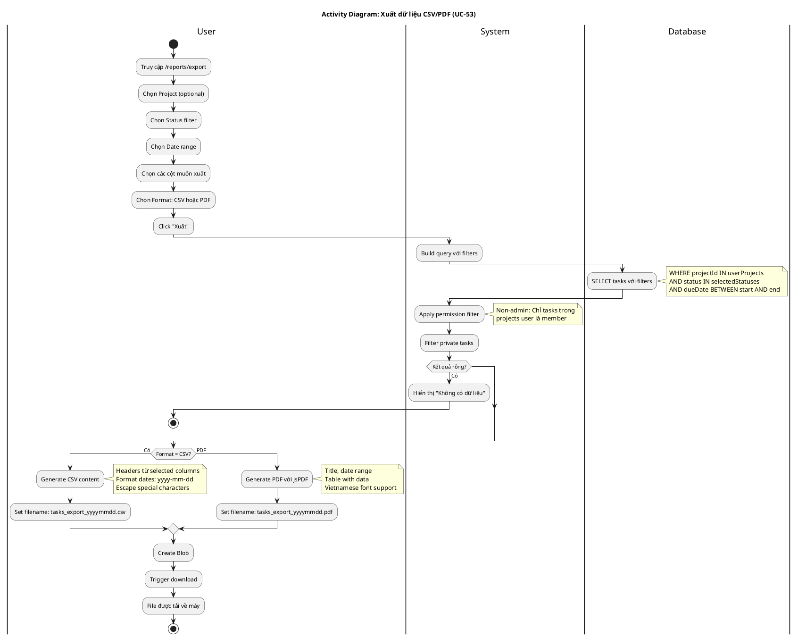

# Activity Diagram 13: Xuất dữ liệu CSV/PDF (UC-53)

> **Use Case**: UC-53 - Xuất dữ liệu CSV/PDF  
> **Module**: Reports  
> **Ngày**: 2026-01-15

---

## 1. Thông tin chung

| Thuộc tính | Giá trị |
|------------|---------|
| **Actors** | User |
| **Độ phức tạp** | Trung bình |
| **Swimlanes** | User, System, Database |

---

## 2. Activity Diagram (PlantUML)

---

## 3. Mô tả các bước

| # | Actor | Hành động | Ghi chú |
|---|-------|-----------|---------|
| 1 | User | Chọn filters | Project, status, dates |
| 2 | User | Chọn columns | Checkboxes |
| 3 | User | Chọn format | CSV/PDF |
| 4 | System | Build query | With filters |
| 5 | Database | Query tasks | Filtered data |
| 6 | System | Apply permissions | Filter by projects |
| 7 | System | Generate file | CSV or PDF |
| 8 | User | Download | Browser download |

---

## 4. Export Columns

| Column | CSV Header | Format |
|--------|------------|--------|
| taskNumber | # | Number |
| subject | Tiêu đề | Text |
| tracker | Loại | Text |
| status | Trạng thái | Text |
| priority | Độ ưu tiên | Text |
| assignee | Người thực hiện | Text |
| dueDate | Hạn chót | yyyy-mm-dd |
| doneRatio | Tiến độ | 0-100% |
| estimatedHours | Giờ dự kiến | Number |

---

## 5. Business Rules

| Rule | Mô tả |
|------|-------|
| BR-01 | Date format: yyyy-mm-dd (unambiguous) |
| BR-02 | CSV: UTF-8 with BOM for Excel |
| BR-03 | PDF: Support Vietnamese |
| BR-04 | Permission filter applied |

---

*Ngày tạo: 2026-01-15*
