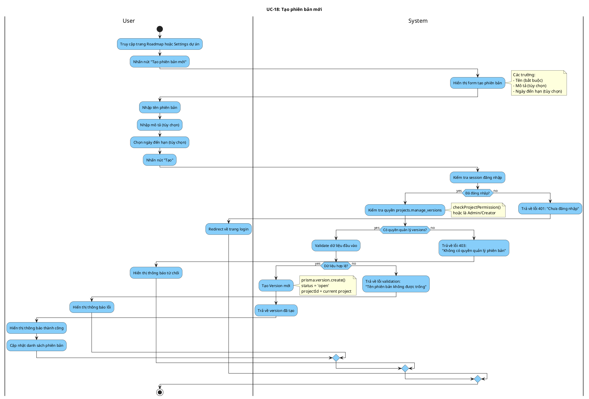

# Activity Diagram: UC-18 - Tạo phiên bản mới

> **Module**: Versions/Milestones  
> **Use Case ID**: UC-18  
> **Tên Use Case**: Tạo phiên bản mới  
> **Ngày tạo**: 2026-01-16

---

## 1. Phân tích LTOT

### 1.1. Mục đích
- Cho phép người có quyền tạo phiên bản/milestone mới cho dự án

### 1.2. Actors
- **User**: Người có quyền `projects.manage_versions`
- **System**: Hệ thống Worksphere

### 1.3. Kết quả có thể
- **Success**: Version được tạo với status = open
- **Failure**: Từ chối (không có quyền, validation lỗi)

### 1.4. Các bước chính
1. User nhấn "Tạo phiên bản"
2. User nhập thông tin
3. System validate và tạo version
4. Trả về kết quả

---

## 2. Activity Diagram

---

## 3. Source Code Reference

| File | Function/Method | Line | Mô tả |
|------|-----------------|------|-------|
| `src/app/api/projects/[id]/versions/route.ts` | `POST()` | - | API tạo version |
| `src/lib/permissions.ts` | `checkProjectPermission()` | - | Kiểm tra quyền |

---

## 4. Business Rules

| ID | Rule | Mô tả |
|----|------|-------|
| BR-01 | Permission Required | Cần quyền projects.manage_versions |
| BR-02 | Default Status | Status mặc định là 'open' |
| BR-03 | Name Required | Tên phiên bản bắt buộc |

---

## 5. Checklist LTOT

- [x] Có đúng 1 start
- [x] Có đúng 1 stop
- [x] Tất cả if-else đều có endif
- [x] Swimlanes phân chia rõ User/System
- [x] Activity đặt tên bằng động từ rõ ràng

---

*Tài liệu được tạo dựa trên phân tích mã nguồn Worksphere*  
*Ngày tạo: 2026-01-16*
