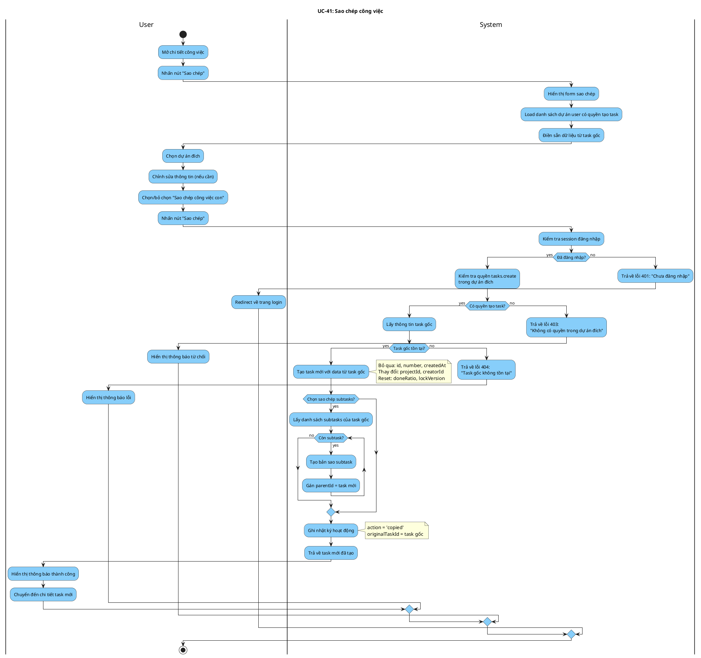

# Activity Diagram: UC-41 - Sao chép công việc

> **Module**: Task Copy  
> **Use Case ID**: UC-41  
> **Tên Use Case**: Sao chép công việc  
> **Ngày tạo**: 2026-01-16

---

## 1. Phân tích LTOT

### 1.1. Mục đích
- Cho phép người dùng sao chép công việc sang dự án khác hoặc cùng dự án

### 1.2. Actors
- **User**: Người có quyền tạo task trong dự án đích
- **System**: Hệ thống Worksphere

### 1.3. Kết quả có thể
- **Success**: Task mới được tạo với data từ task gốc
- **Failure**: Từ chối (không có quyền, dự án đích không hợp lệ)

### 1.4. Các bước chính
1. User chọn task cần sao chép
2. User chọn dự án đích và tùy chọn
3. System validate quyền và tạo task mới
4. System (tùy chọn) sao chép subtasks

---

## 2. Activity Diagram

---

## 3. Source Code Reference

| File | Function/Method | Line | Mô tả |
|------|-----------------|------|-------|
| `src/app/api/tasks/[id]/copy/route.ts` | `POST()` | - | API sao chép task |

---

## 4. Business Rules

| ID | Rule | Mô tả |
|----|------|-------|
| BR-01 | Permission Required | Cần quyền tasks.create trong dự án đích |
| BR-02 | Reset Fields | Reset doneRatio, lockVersion khi copy |
| BR-03 | New Number | Task mới có số thứ tự mới |
| BR-04 | Optional Subtasks | Tùy chọn sao chép cả subtasks |
| BR-05 | New Creator | creatorId = người thực hiện copy |

---

## 5. Checklist LTOT

- [x] Có đúng 1 start
- [x] Có đúng 1 stop
- [x] Tất cả if-else đều có endif
- [x] While loop có end condition
- [x] Swimlanes phân chia rõ User/System
- [x] Activity đặt tên bằng động từ rõ ràng

---

*Tài liệu được tạo dựa trên phân tích mã nguồn Worksphere*  
*Ngày tạo: 2026-01-16*
