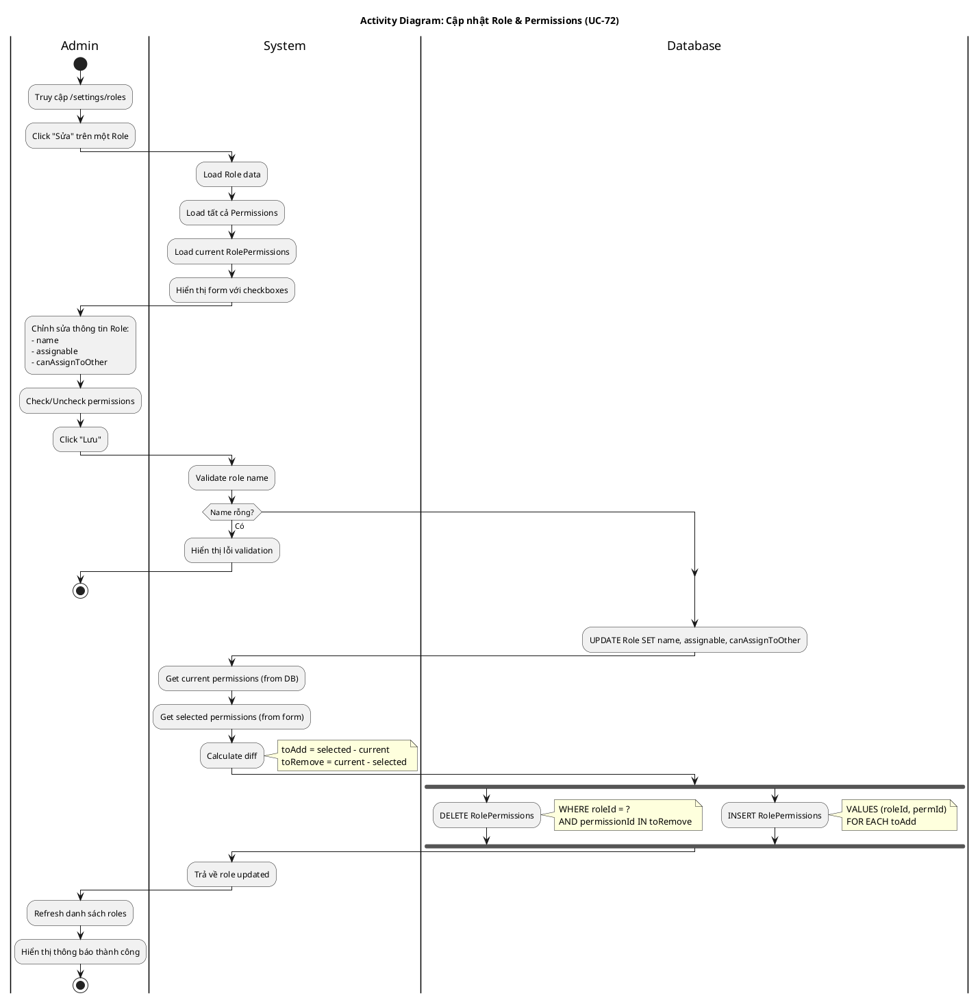

# Activity Diagram 14: Cập nhật Role & Permissions (UC-72)

> **Use Case**: UC-72 - Cập nhật Role & Permissions  
> **Module**: Roles Configuration  
> **Ngày**: 2026-01-15

---

## 1. Thông tin chung

| Thuộc tính | Giá trị |
|------------|---------|
| **Actors** | Administrator |
| **Độ phức tạp** | Trung bình |
| **Swimlanes** | Admin, System, Database |
| **Đặc điểm** | Sync permissions (add/remove) |

---

## 2. Activity Diagram (PlantUML)



---

## 3. Permission Sync Logic

```javascript
// Pseudo-code
currentPerms = DB.getRolePermissions(roleId)
selectedPerms = form.getCheckedPermissions()

toAdd = selectedPerms.filter(p => !currentPerms.includes(p))
toRemove = currentPerms.filter(p => !selectedPerms.includes(p))

// Execute
DELETE FROM RolePermission WHERE roleId=? AND permissionId IN toRemove
INSERT INTO RolePermission (roleId, permissionId) VALUES ... toAdd
```

---

## 4. Role Fields

| Field | Type | Mô tả |
|-------|------|-------|
| name | String | Tên role (Developer, Tester...) |
| assignable | Boolean | Có thể được gán task |
| canAssignToOther | Boolean | Có thể gán task cho người khác |

---

## 5. Business Rules

| Rule | Mô tả |
|------|-------|
| BR-01 | Chỉ Admin mới sửa được Role |
| BR-02 | Permissions sync = add mới + remove cũ |
| BR-03 | Role name không được trống |

---

*Ngày tạo: 2026-01-15*
