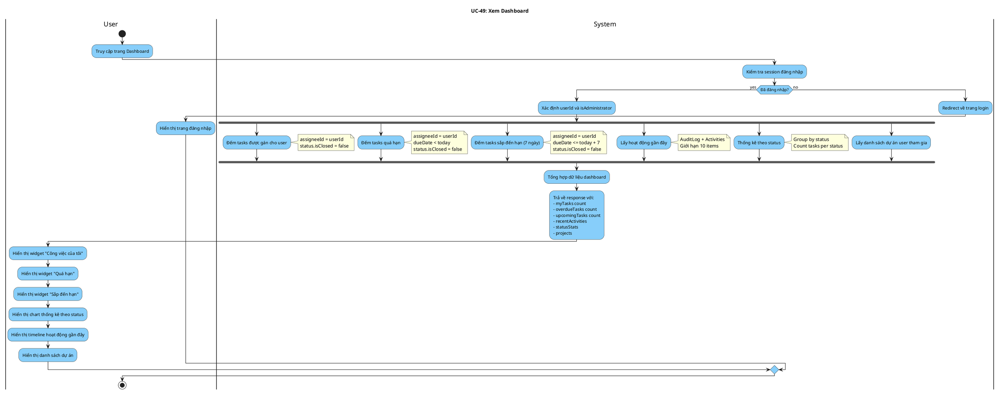

# Activity Diagram: UC-49 - Xem Dashboard

> **Module**: Dashboard & Reports  
> **Use Case ID**: UC-49  
> **Tên Use Case**: Xem Dashboard  
> **Ngày tạo**: 2026-01-16

---

## 1. Phân tích LTOT

### 1.1. Mục đích
- Cho phép người dùng xem tổng quan: tasks được gán, quá hạn, sắp đến hạn, hoạt động gần đây

### 1.2. Actors
- **User**: Người dùng đã đăng nhập
- **System**: Hệ thống Worksphere

### 1.3. Kết quả có thể
- **Success**: Hiển thị dashboard với các widgets thống kê

### 1.4. Các bước chính
1. User truy cập Dashboard
2. System truy vấn song song các dữ liệu
3. System trả về dữ liệu cho các widgets
4. User xem thông tin tổng hợp

---

## 2. Activity Diagram

---

## 3. Source Code Reference

| File | Function/Method | Line | Mô tả |
|------|-----------------|------|-------|
| `src/app/api/dashboard/route.ts` | `GET()` | - | API dashboard data |
| `src/app/(dashboard)/dashboard/page.tsx` | - | - | Dashboard page component |

---

## 4. Business Rules

| ID | Rule | Mô tả |
|----|------|-------|
| BR-01 | Authenticated Only | Phải đăng nhập mới xem được |
| BR-02 | User Scope | Chỉ hiện tasks được gán cho mình |
| BR-03 | Overdue Definition | Quá hạn = dueDate < today && chưa đóng |
| BR-04 | Upcoming 7 Days | Sắp đến hạn = dueDate trong 7 ngày tới |

---

## 5. Checklist LTOT

- [x] Có đúng 1 start
- [x] Có đúng 1 stop
- [x] Fork/Join cho truy vấn song song
- [x] Tất cả if-else đều có endif
- [x] Swimlanes phân chia rõ User/System
- [x] Activity đặt tên bằng động từ rõ ràng

---

*Tài liệu được tạo dựa trên phân tích mã nguồn Worksphere*  
*Ngày tạo: 2026-01-16*
