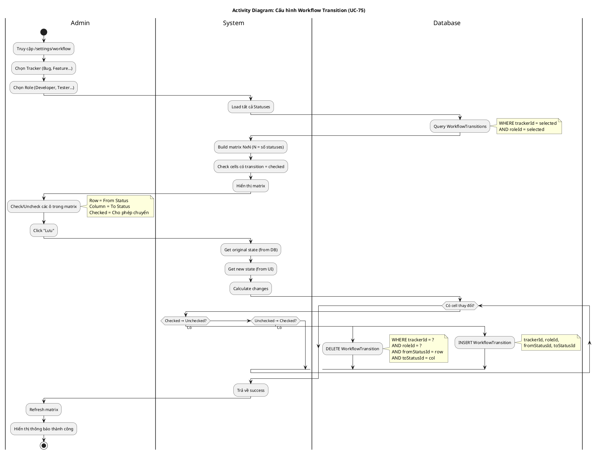

# Activity Diagram 15: Cấu hình Workflow Transition (UC-75)

> **Use Case**: UC-75 - Cấu hình Workflow Transition  
> **Module**: Workflow Configuration  
> **Ngày**: 2026-01-15

---

## 1. Thông tin chung

| Thuộc tính | Giá trị |
|------------|---------|
| **Actors** | Administrator |
| **Độ phức tạp** | Cao |
| **Swimlanes** | Admin, System, Database |
| **Đặc điểm** | Matrix update, Loop processing |

---

## 2. Activity Diagram (PlantUML)



---

## 3. Workflow Matrix Example

```
Tracker: Bug    Role: Developer

             │ New │ InProg │ Resolved │ Closed │
─────────────┼─────┼────────┼──────────┼────────┤
New          │  -  │   ✓    │    ✓     │        │
InProgress   │     │   -    │    ✓     │        │
Resolved     │     │   ✓    │    -     │        │
Closed       │     │        │          │   -    │

✓ = Transition được phép
(empty) = Không được phép
- = Same status (N/A)
```

---

## 4. Transition Record

| Field | Type | Mô tả |
|-------|------|-------|
| trackerId | FK | Bug, Feature, Task... |
| roleId | FK | Developer, Tester... |
| fromStatusId | FK | Status bắt đầu |
| toStatusId | FK | Status đích |

---

## 5. Business Rules

| Rule | Mô tả |
|------|-------|
| BR-01 | Workflow định nghĩa theo cặp (Tracker, Role) |
| BR-02 | Không thể chuyển sang cùng status |
| BR-03 | Task chỉ chuyển status theo transition đã định nghĩa |
| BR-04 | Admin có thể override workflow |

---

## 6. Impact

Khi workflow được cấu hình:
- UC-26 (Thay đổi trạng thái) sẽ validate theo matrix này
- User chỉ thấy dropdown status dựa trên allowed transitions

---

*Ngày tạo: 2026-01-15*
