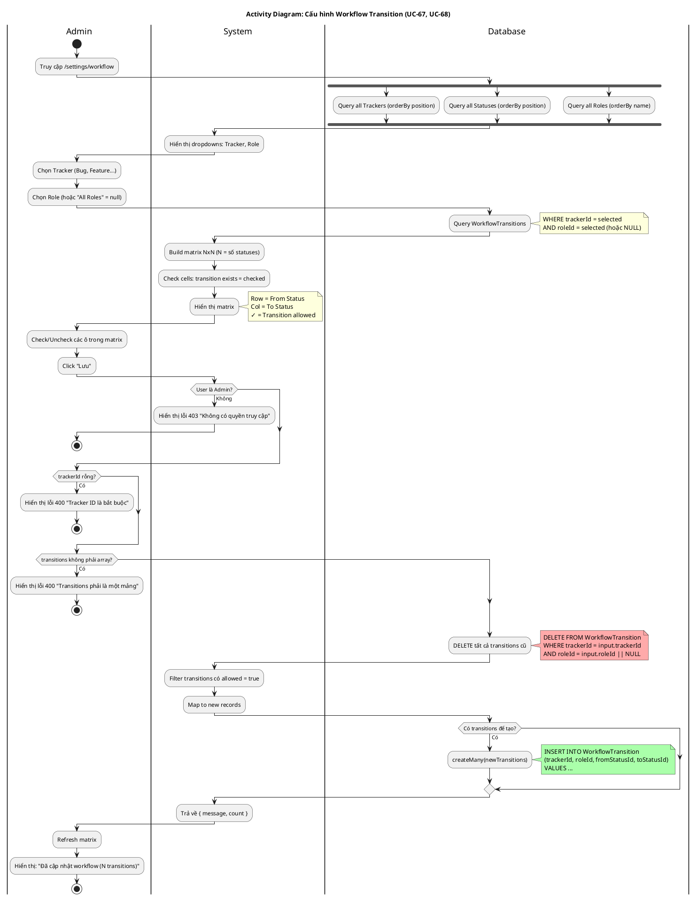

# Activity Diagram 15: Cấu hình Workflow Transition (UC-68)

> **Use Case**: UC-68 - Cập nhật Workflow  
> **Module**: Workflow Configuration  
> **Phiên bản**: 1.1  
> **Ngày cập nhật**: 2026-01-16

---

## 1. Thông tin chung

| Thuộc tính | Giá trị |
|------------|---------|
| **Actors** | Administrator |
| **Độ phức tạp** | Cao |
| **Swimlanes** | Admin, System, Database |
| **Đặc điểm** | Delete-then-Create pattern, Matrix UI |
| **Use Case tham chiếu** | [UC-67](../usecases/19-workflow-management.md), [UC-68](../usecases/19-workflow-management.md) |

---

## 2. Activity Diagram (PlantUML)



---

## 3. Workflow Matrix Example

```
Tracker: Bug    Role: Developer

             │ New │ InProg │ Resolved │ Closed │
─────────────┼─────┼────────┼──────────┼────────┤
New          │  -  │   ✓    │    ✓     │        │
InProgress   │     │   -    │    ✓     │        │
Resolved     │     │   ✓    │    -     │        │
Closed       │     │        │          │   -    │

✓ = Transition được phép (record exists)
(empty) = Không được phép
- = Same status (N/A)
```

---

## 4. Update Pattern (Khớp với UC-68)

**Delete-then-Create** (không phải incremental update):

```
POST /api/workflow
{
  "trackerId": "xxx",
  "roleId": "yyy" (hoặc null = all roles),
  "transitions": [
    { "fromStatusId": "s1", "toStatusId": "s2", "allowed": true },
    { "fromStatusId": "s1", "toStatusId": "s3", "allowed": true },
    { "fromStatusId": "s2", "toStatusId": "s3", "allowed": false },
    ...
  ]
}

Step 1: DELETE ALL WHERE trackerId=xxx AND roleId=yyy
Step 2: INSERT only where allowed=true
```

---

## 5. Decision Points (Khớp với UC Exception Flows)

| # | Condition | True | False | UC Ref |
|---|-----------|------|-------|--------|
| D1 | User là Admin? | Tiếp tục | Error 403 | E1 |
| D2 | trackerId có? | Tiếp tục | Error 400 | E2 |
| D3 | transitions là array? | Tiếp tục | Error 400 | E3 |

---

## 6. Business Rules (Khớp với UC-68)

| Rule | Mô tả | UC Ref |
|------|-------|--------|
| BR-01 | Chỉ Admin được cập nhật workflow | BR-02 |
| BR-02 | roleId = NULL áp dụng cho tất cả roles | BR-01 |
| BR-03 | trackerId là bắt buộc | BR-03 |
| BR-04 | Delete-Create pattern đảm bảo idempotent | BR-04 |
| BR-05 | Batch insert với createMany | BR-05 |

---

## 7. Impact

Khi workflow được cấu hình:
- **UC-26** (Thay đổi trạng thái) validate theo transitions này
- User chỉ thấy dropdown status dựa trên allowed transitions
- Admin bypass workflow validation

---

*Cập nhật: 2026-01-16 - Đồng bộ hoàn toàn với UC-67, UC-68*
