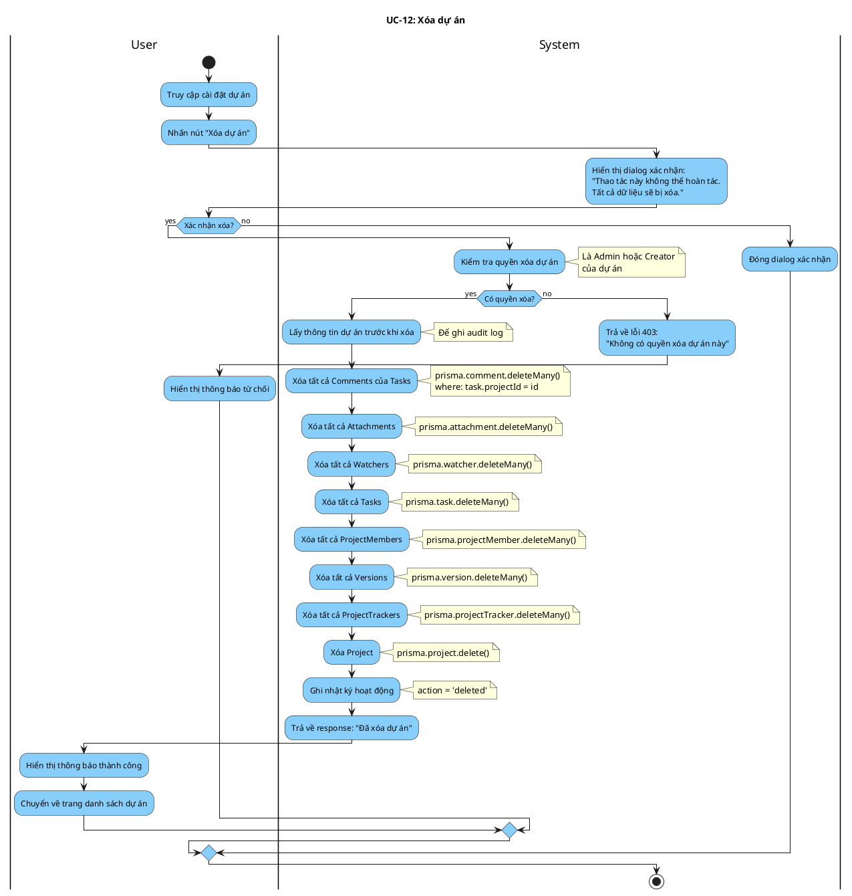

# Activity Diagram: UC-12 - Xóa dự án

> **Module**: Project Management  
> **Use Case ID**: UC-12  
> **Tên Use Case**: Xóa dự án  
> **Ngày tạo**: 2026-01-16

---

## 1. Phân tích LTOT

### 1.1. Mục đích
- Cho phép người tạo dự án hoặc Admin xóa hoàn toàn dự án và tất cả dữ liệu liên quan

### 1.2. Actors
- **User**: Người tạo dự án (Creator)
- **Administrator**: Quản trị viên hệ thống
- **System**: Hệ thống Worksphere

### 1.3. Kết quả có thể
- **Success**: Dự án và tất cả dữ liệu liên quan bị xóa
- **Failure**: Từ chối nếu không có quyền

### 1.4. Các bước chính
1. User nhấn "Xóa dự án"
2. User xác nhận
3. System xóa cascade dữ liệu
4. System xóa dự án

---

## 2. Activity Diagram

---

## 3. Source Code Reference

| File | Function/Method | Line | Mô tả |
|------|-----------------|------|-------|
| `src/app/api/projects/[id]/route.ts` | `DELETE()` | - | API xóa project |

---

## 4. Business Rules

| ID | Rule | Mô tả |
|----|------|-------|
| BR-01 | Creator or Admin | Chỉ Creator hoặc Admin mới được xóa |
| BR-02 | Cascade Delete | Xóa tất cả dữ liệu liên quan |
| BR-03 | Confirmation Required | Bắt buộc xác nhận trước khi xóa |
| BR-04 | Irreversible | Không thể hoàn tác sau khi xóa |

---

## 5. Checklist LTOT

- [x] Có đúng 1 start
- [x] Có đúng 1 stop
- [x] Tất cả if-else đều có endif
- [x] Swimlanes phân chia rõ User/System
- [x] Activity đặt tên bằng động từ rõ ràng

---

*Tài liệu được tạo dựa trên phân tích mã nguồn Worksphere*  
*Ngày tạo: 2026-01-16*
