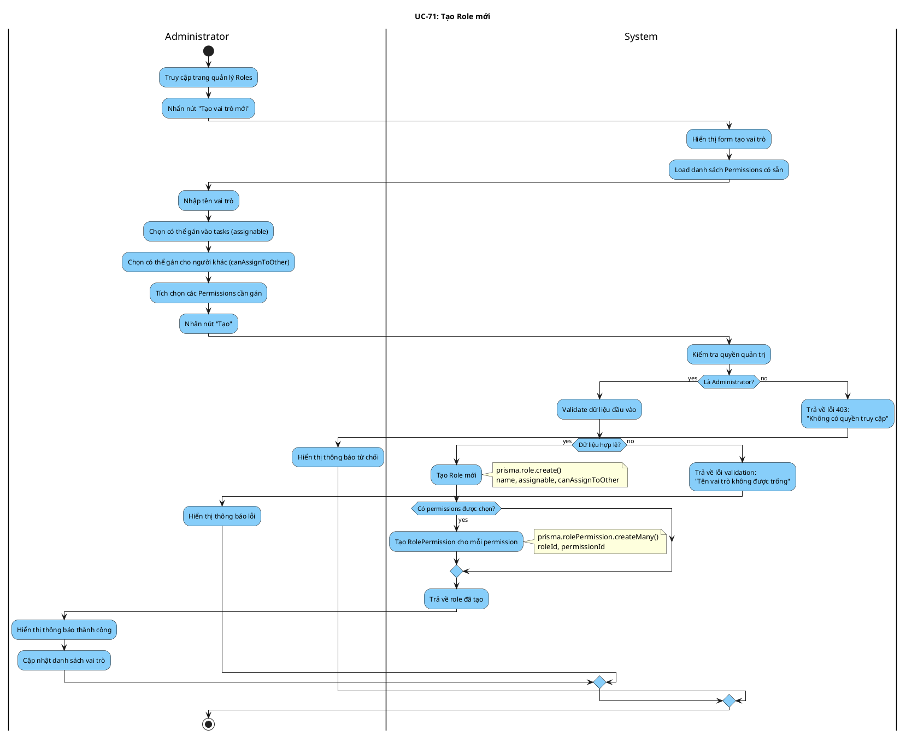

# Activity Diagram: UC-71 - Tạo Role mới

> **Module**: Role Management  
> **Use Case ID**: UC-71  
> **Tên Use Case**: Tạo Role  
> **Ngày tạo**: 2026-01-16

---

## 1. Phân tích LTOT

### 1.1. Mục đích
- Cho phép Administrator tạo vai trò mới với tên, quyền gán và permissions

### 1.2. Actors
- **Administrator**: Quản trị viên hệ thống
- **System**: Hệ thống Worksphere

### 1.3. Kết quả có thể
- **Success**: Role được tạo với permissions được gán
- **Failure**: Từ chối nếu không phải Admin

### 1.4. Các bước chính
1. Admin nhấn "Tạo vai trò"
2. Admin nhập tên và chọn permissions
3. System tạo role và gán permissions

---

## 2. Activity Diagram

---

## 3. Source Code Reference

| File | Function/Method | Line | Mô tả |
|------|-----------------|------|-------|
| `src/app/api/roles/route.ts` | `POST()` | - | API tạo role |

---

## 4. Business Rules

| ID | Rule | Mô tả |
|----|------|-------|
| BR-01 | Admin Only | Chỉ Admin mới được tạo role |
| BR-02 | Name Required | Tên vai trò bắt buộc |
| BR-03 | Assignable | Quyết định role có thể gán vào tasks |
| BR-04 | canAssignToOther | Cho phép gán task cho người khác |

---

## 5. Checklist LTOT

- [x] Có đúng 1 start
- [x] Có đúng 1 stop
- [x] Tất cả if-else đều có endif
- [x] Swimlanes phân chia rõ Admin/System
- [x] Activity đặt tên bằng động từ rõ ràng

---

*Tài liệu được tạo dựa trên phân tích mã nguồn Worksphere*  
*Ngày tạo: 2026-01-16*
