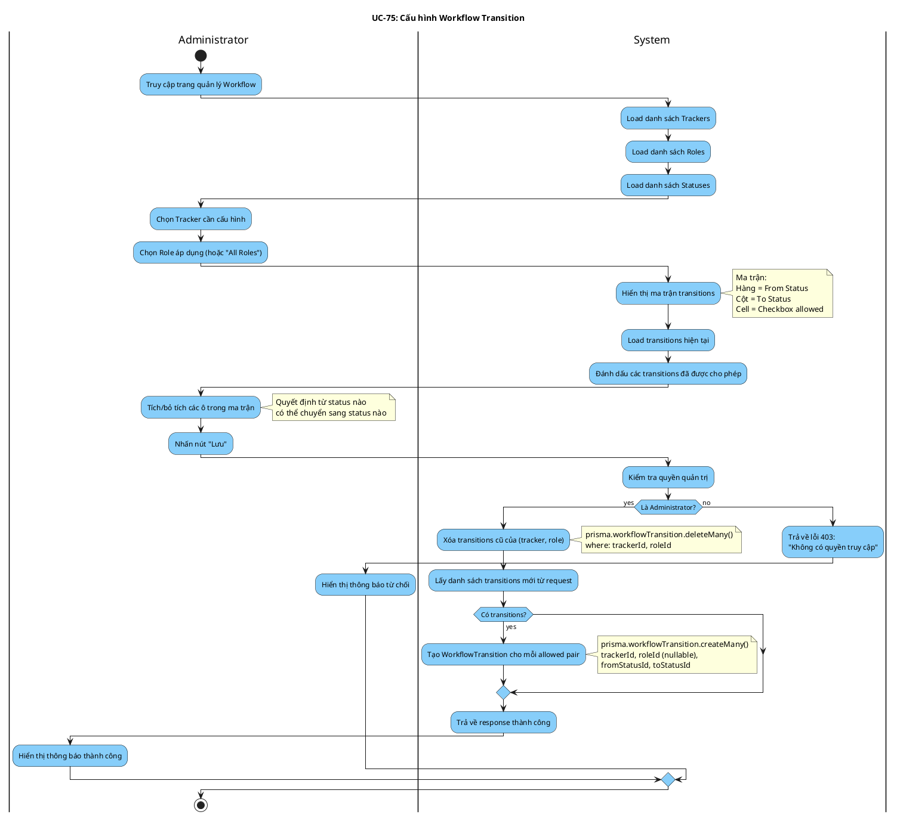

# Activity Diagram: UC-75 - Cấu hình Workflow Transition

> **Module**: Workflow Management  
> **Use Case ID**: UC-75  
> **Tên Use Case**: Cấu hình Transition  
> **Ngày tạo**: 2026-01-16

---

## 1. Phân tích LTOT

### 1.1. Mục đích
- Cho phép Administrator định nghĩa chuyển đổi trạng thái cho (tracker, role)

### 1.2. Actors
- **Administrator**: Quản trị viên hệ thống
- **System**: Hệ thống Worksphere

### 1.3. Kết quả có thể
- **Success**: Workflow transitions được lưu
- **Failure**: Từ chối nếu không phải Admin

### 1.4. Các bước chính
1. Admin chọn tracker và role
2. Admin tích chọn transitions được phép
3. System lưu cấu hình

---

## 2. Activity Diagram

---

## 3. Source Code Reference

| File | Function/Method | Line | Mô tả |
|------|-----------------|------|-------|
| `src/app/api/workflows/route.ts` | `POST()` | - | API lưu workflow |

---

## 4. Business Rules

| ID | Rule | Mô tả |
|----|------|-------|
| BR-01 | Admin Only | Chỉ Admin mới được cấu hình workflow |
| BR-02 | Tracker Based | Workflow áp dụng theo từng Tracker |
| BR-03 | Role Based | Có thể áp dụng cho role cụ thể hoặc tất cả |
| BR-04 | Replace All | Xóa cấu hình cũ trước khi lưu mới |

---

## 5. Checklist LTOT

- [x] Có đúng 1 start
- [x] Có đúng 1 stop
- [x] Tất cả if-else đều có endif
- [x] Swimlanes phân chia rõ Admin/System
- [x] Activity đặt tên bằng động từ rõ ràng

---

*Tài liệu được tạo dựa trên phân tích mã nguồn Worksphere*  
*Ngày tạo: 2026-01-16*
