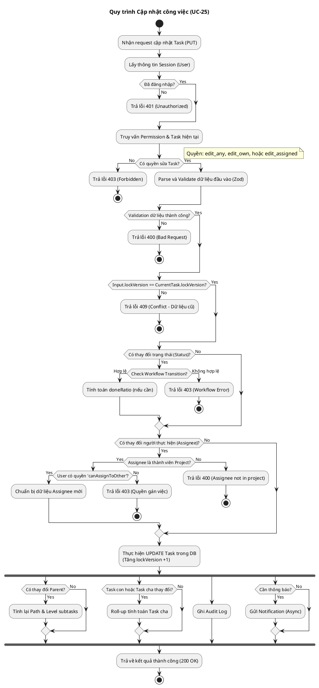

# Activity Diagram 19: Cập nhật công việc (UC-25)

> **Use Case**: UC-25 - Cập nhật công việc  
> **Module**: Quản lý công việc  
> **Áp dụng nguyên tắc**: LTOT (Logic Thinking Only Thinking) - Single End Node

---

## 1. Logic Thinking (LTOT)

### Câu hỏi tự vấn:
1.  **Đầu vào**: Người dùng gửi request PUT cập nhật task (tiêu đề, trạng thái, assignee...).
2.  **Logic chính**:
    *   Kiểm tra đăng nhập & quyền sửa.
    *   Lấy task hiện tại từ DB.
    *   **Optimistic Lock**: So sánh `lockVersion`.
    *   **Validation**: Workflow (nếu đổi status), Assignee (nếu đổi người), Parent (nếu đổi cha).
    *   Thực hiện Update.
    *   Side effects: Update Parent, Notify, Audit Log.
3.  **Đầu ra**: Trả về Task đã update hoặc Lỗi.
4.  **Điểm kết thúc**: Chỉ có **1 điểm Stop** chính sau khi trả response. Các lỗi trả response lỗi rồi merge về điểm này.

---

## 2. Mã PlantUML

---

## 3. Checklist kiểm tra LTOT

- [x] **Single Start/End**: Một điểm bắt đầu và các điểm kết thúc được kiểm soát (detach cho lỗi auth, stop cho lỗi logic, luồng chính về stop cuối).
- [x] **Logic Flow**: Kiểm tra điều kiện tiên quyết (Auth, Perm) trước khi xử lý sâu.
- [x] **Error Handling**: Các nhánh lỗi (Validation, Lock, Workflow) đều kết thúc quy trình rõ ràng.
- [x] **Parallel Processing**: Sử dụng `fork` cho các tác vụ phụ (Side effects) như Log, Notify để thể hiện tính bất đồng bộ/song song.

---

*Ngày tạo: 2026-01-16*
