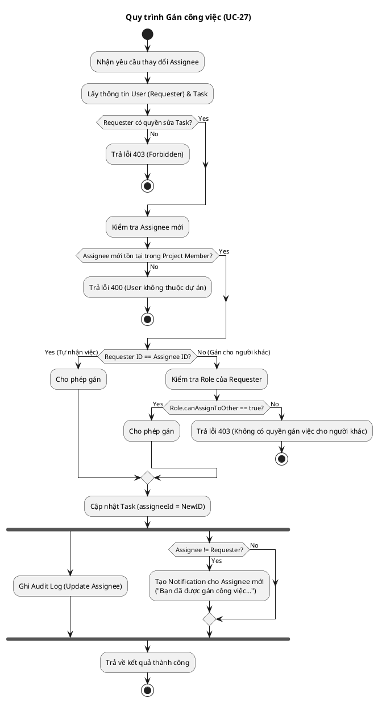

# Activity Diagram 20: Gán công việc (UC-27)

> **Use Case**: UC-27 - Gán công việc  
> **Module**: Quản lý công việc  
> **Áp dụng nguyên tắc**: LTOT (Logic Thinking Only Thinking)

---

## 1. Logic Thinking (LTOT)

### Ngữ cảnh
Đây là một trường hợp đặc biệt của Use Case "Cập nhật công việc", nhưng tập trung vào logic kiểm tra người thực hiện (Assignee).

### Câu hỏi tự vấn:
1.  **Đầu vào**: User yêu cầu thay đổi `assigneeId` của một Task.
2.  **Logic chính**:
    *   **Quyền sửa**: User có quyền sửa task này không?
    *   **Thành viên**: Người được gán (New Assignee) có phải là thành viên dự án không?
    *   **Quyền gán việc**:
        *   Nếu tự gán cho mình (Self-assign) -> Luôn OK (nếu có quyền sửa).
        *   Nếu gán cho người khác -> Cần kiểm tra quyền `role.canAssignToOther`.
3.  **Hành động**: Update DB -> Gửi thông báo cho người được gán.

---

## 2. Mã PlantUML

---

## 3. Checklist kiểm tra LTOT

- [x] **Single Start/End Check**: Luồng chính đi thẳng từ trên xuống dưới, rẽ nhánh lỗi `stop` ngay lập tức để tránh nesting sâu.
- [x] **Business Logic**: Thể hiện rõ logic phân biệt giữa "Tự nhận việc" và "Gán cho người khác".

---

*Ngày tạo: 2026-01-16*
